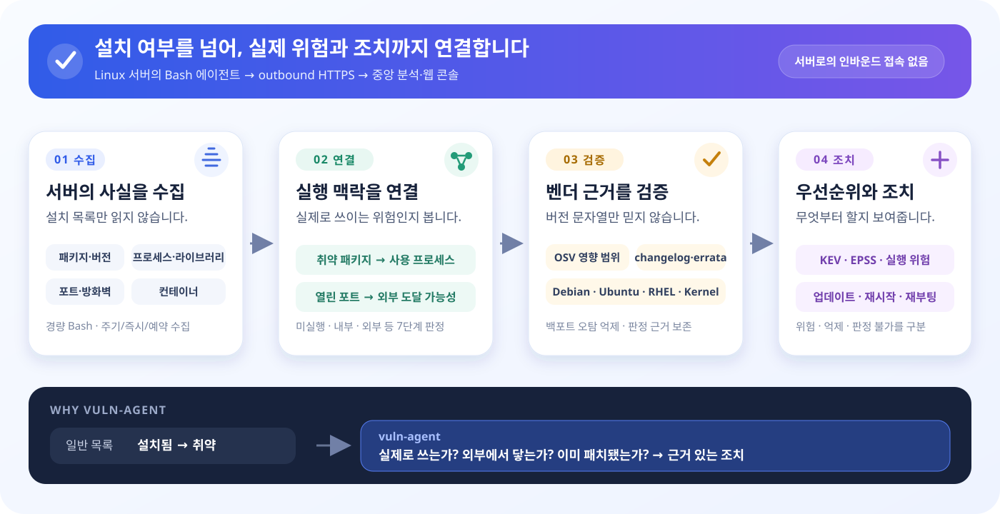

# vuln-agent

> 설치된 취약점의 개수보다, **지금 이 서버에서 실제로 위험한 취약점**을 먼저 보여주는 경량 취약점 진단 플랫폼

일반적인 버전 비교는 패키지가 설치돼 있다는 이유만으로 많은 경고를 만듭니다. `vuln-agent`는
설치 패키지에 더해 **실행 중인 프로세스, 로드된 라이브러리, 열린 포트와 방화벽 상태**를 함께 수집합니다.
중앙 서버는 이 실행 맥락과 검증된 보안 피드를 결합해 실제 대응 우선순위를 판단합니다.

억제한 결과도 숨기지 않습니다. “배포판이 보안 패치를 백포트했기 때문”, “프로세스가 아직 옛
라이브러리를 사용 중이기 때문”처럼 **판정 근거와 필요한 조치**를 웹에서 확인할 수 있습니다.

<picture>
  <source media="(max-width: 700px)" srcset="docs/readme-flow-mobile.svg">
  
</picture>

| 프로젝트 이해하기 | 직접 사용하기 | 구조 살펴보기 |
|---|---|---|
| [왜 만들었고 무엇이 다른가](docs/dev/설명글.md) | [에이전트 설치·운영](agent/README.md) | [아키텍처와 판정 흐름](docs/dev/architecture.md) |
| [웹에서 제공하는 기능](#웹에서-확인할-수-있는-것) | [개발·운영 배포](deploy/README.md) | [ERD·배포·사이트맵](docs/specs/diagrams/README.md) |

## 무엇이 다른가

| 흔한 취약점 목록 | vuln-agent |
|---|---|
| 설치 버전만 보고 취약 여부 판정 | 실행·로드·리스닝·외부 노출까지 연결해 7단계 상태로 구분 |
| 백포트된 패키지도 오래된 버전처럼 보여 오탐 발생 | OSV 범위와 changelog·errata·벤더 OVAL을 교차 확인 |
| 패치 여부만 안내 | 프로세스 재시작, 커널 재부팅, 이미지 재빌드 등 실제 조치 구분 |
| 지원하지 않는 대상도 취약점 0건으로 보일 수 있음 | 피드나 패키지 DB가 없으면 안전이 아닌 **판정 불가**로 표시 |
| 억제된 결과는 보이지 않음 | 억제 사유와 원본 근거를 별도 이력으로 보존 |
| 해외 공통 피드 중심 | CISA KEV·EPSS와 함께 KISA 국내 보안공지 연동 |

### 핵심 기능

- **런타임 노출 상관** — 취약 라이브러리 → 사용 프로세스 → 리스닝 포트 → 외부 도달 여부를 연결합니다.
- **설명 가능한 오탐 억제** — 배포판 백포트와 벤더 수정 근거를 확인하고 억제 이유를 남깁니다.
- **패치 후 잔여 위험 탐지** — 옛 `.so`를 사용하는 프로세스와 재부팅 전 커널은 다시 위험으로 올립니다.
- **호스트·컨테이너 통합 인벤토리** — 호스트와 실행 중 컨테이너의 패키지·프로세스·노출을 분리해 보고,
  자산마다 중요도와 N2SF 보안등급(C/S/O)을 관리합니다. 시스템이 제안한 등급과 사람이 확정한 등급은 분리해 둡니다.
- **계정 인벤토리** — 실제 계정 목록(UID·셸·잠금·최근 로그인·sudo 권한)을 수집해 ISMS-P 2.5.x·N2SF 계정관리
  관점으로 판정합니다. 공유계정·미사용 계정은 단정하지 않고 사람이 확인할 항목으로 표시하며, 패스워드 해시는
  수집·저장하지 않습니다.
- **악용 가능성 우선순위** — CVSS뿐 아니라 CISA KEV와 EPSS를 함께 반영합니다.
- **제거·대체 검토 권고** — 벤더가 고치지 않는 CVE가 한 패키지에 몰리면 개별 CVE 수십 건 대신
  그 패키지의 제거·대체 검토를 권고합니다. 실제 조치는 패키지 하나를 정리하는 것이기 때문입니다.
- **미조치 사유와 승인자 기록** — 지금 고칠 수 없는 건에 사유와 승인자를 남기고 Export API로 넘깁니다.
  결재 워크플로는 만들지 않고 외부 시스템에 연계할 최소 필드만 둡니다.
- **보안 설정 점검** — 수집된 시스템 사실로 CCE/SSG 기반 설정(SSH·계정·권한·시간동기화·로그·암호화)을
  PASS·FAIL·판정 불가로 구분하고, 같은 점검 결과를 ISMS-P·기반시설 U-코드·N2SF 기준으로 각각 매핑해 보여줍니다.
- **컴플라이언스 매핑** — 패치관리·정보자산 식별·보안시스템 운영 등 자동판정 가능한 통제만 KISA
  ISMS-P·ISO 27001 기준으로 자동 판정하고, 정책·승인이력처럼 사람이 심사해야 하는 항목은 체크리스트로 둡니다.
  판정 근거가 부족하면 준수가 아니라 **판정 불가**로 두고, SLA 기준일은 설정 화면에서 조직에 맞게 바꿉니다.
  하루 1건 스냅샷을 남겨 심사 시점의 준수 상태를 날짜별로 되짚을 수 있습니다.
- **오픈소스 구성요소 분석(SCA)** — pip/npm/gem/composer/maven/nuget/cargo/go 8개 언어 생태계
  패키지를 CVE와 매칭하고, SBOM·설치 메타데이터에서 확인되는 라이선스를 허용적·카피레프트·미상으로
  분류합니다.
- **함대 운영** — 웹에서 자산별 즉시·예약 수집, 주기 변경, 진행률 확인과 실행 중단이 가능합니다.
- **변화와 감사 이력** — 실제 수집 실행, 패키지 변화, 취약점 변화와 사용자 조작을 추적합니다. 접속기록은
  접속일시·식별자·접속지 IP·처리 대상·수행업무 5요소로 남기고, 월 1회 점검 결과를 기록할 수 있습니다.

## 동작 방식

1. 각 Linux 서버의 Bash 에이전트가 패키지와 런타임 사실을 읽습니다.
2. 에이전트가 아웃바운드 HTTPS로 중앙 서버에 전송합니다. 중앙에서 대상 서버로 접속하지 않습니다.
3. 중앙 매처가 NVD·OSV·KEV·EPSS와 배포판·커널 벤더 피드를 대조합니다.
4. 웹에서 위험도, 실행 맥락, 판정 근거, 조치 버전과 변화 이력을 확인합니다.

더 자세한 구성과 데이터 이동은 [시스템 구성도·ERD·배포 흐름](docs/specs/diagrams/README.md)에서 확인할 수 있습니다.

에이전트는 systemd 환경에서 10초마다 명령을 확인하는 상시 서비스로 동작하며, 무거운 수집은
호스트별 설정 주기에만 실행합니다. 서버 전체 자원 사용량이 아니라 **에이전트 프로세스 트리의 CPU와
피크 RSS**를 실행별로 기록합니다.

## 웹에서 확인할 수 있는 것

- 전체 자산 위험 현황과 우선순위
- 호스트별 취약점, 설치 패키지, 프로세스, 열린 포트, 계정과 컨테이너 대장(k8s 위치·이미지 다이제스트·SBOM)
- 취약점별 CVSS·EPSS·KEV, 영향 위치, 수정 버전과 판정 근거
- 백포트로 억제된 항목, 재시작·재부팅 필요 항목, 미조치 사유와 승인자
- 벤더가 고치지 않는 CVE가 몰려 제거·대체를 검토할 패키지
- 전체 자산의 설치 패키지 통합 검색, 언어 패키지 라이선스 위험도, 의존성 그래프(무엇이 이 패키지를 끌어왔나)
- 자산별 중요도와 N2SF 보안등급(확정값·시스템 제안값)
- 컴플라이언스 통제별 준수 판정과 날짜별 추이, 통제 기준(ISMS-P·U-코드·N2SF)별 점검 매핑
- 외부 보안 피드 수집 상태와 실행 이력
- 역할 기반 권한, API 키·에이전트 키(유효기간 포함), 5요소 접속기록과 점검 이력

## 자산 등급 (N2SF C/S/O)

자산마다 **업무 중요도**(상·중·하)와 **N2SF 보안등급**을 기록합니다.

| 등급 | 뜻 | 보호수준 |
|---|---|---|
| **C** | 기밀 | 높음 |
| **S** | 민감 | 중간 |
| **O** | 공개 | 낮음 |

한 정보시스템에 여러 업무정보 등급이 섞이면 **가장 높은 등급을 승계**합니다(O < S < C).
자산 목록 상단의 "정보시스템 등급"이 그 승계값이며, **확정된 등급만** 셉니다.

### 확정은 사람이, 초안은 시스템이

등급 확정은 「정보공개법」 제9조 비공개 대상정보의 호 매핑에 따른 **기관의 법적 처분**이라
시스템이 대신할 수 없습니다. 그래서 확정값과 시스템 제안값을 **별도 컬럼으로 분리**하고,
제안값을 확정 폼의 기본 선택으로 미리 채우지 않습니다. 확정은 관리자만 할 수 있고
확정자·시각·근거가 감사로그에 남습니다.

자산 목록 상단에 **등급 미확정** 자산 수가 함께 뜨고, 눌러서 그 자산만 거를 수 있습니다.
관리자는 목록에서 여러 자산을 골라 **한 번에 확정**할 수 있습니다 — 등급은 사람이 직접 고르며
(제안값을 그대로 승인하는 버튼은 없습니다), 확정자·시각·근거는 자산마다 따로 감사로그에 남습니다.
확정 해제는 자산 상세에서 한 대씩 합니다.

시스템 제안은 수집한 시스템 사실을 사람이 검토할 후보로 좁히는 기능입니다(우선순위 순):

| 제안 | 수집으로 관찰한 시스템 사실 | 검토 후보가 되는 이유 | 자동 수집으로 알 수 없는 것 |
|---|---|---|---|
| **S** | rsyslogd·syslog-ng·syslogd가 루프백이 아닌 범위(`scope <> LOCAL`)의 포트를 열고 있음 | 다른 호스트의 로그를 받는 로그 처리 시스템일 가능성이 있어 S 검토 대상이 됨 | 실제로 원격 로그를 받는지, 그 로그가 비공개 대상정보인지, 해당 포트에 누가 도달할 수 있는지는 확정할 수 없음 |
| **S** | fluentd·filebeat·restic·bacula 등 역할이 특정되는 로그수집·전송 또는 백업 프로세스가 실행 중 | 로그나 백업을 처리할 가능성이 있어 S 검토 대상이 됨 | 프로세스 이름만으로 실제 역할·처리 중인 정보·설정·보존 내용을 확정할 수 없음 |
| **O** | 수집 결과에 `EXTERNAL` 도달 가능 포트가 하나 이상 있음 | 외부에 서비스를 제공하는 자산일 가능성이 있어 공개 서비스 영역의 O 검토 신호가 됨 | 포트에서 제공하는 정보의 내용, 공개 승인 여부, 법적으로 공개 가능한 정보인지는 알 수 없음 |
| **C** | 자동 제안 없음 | 업무정보의 내용과 법률·기관별 판단을 검토해야 함 | 수집기는 업무 내용, 법적 비공개 사유, 공개 시 국가안보 등에 미치는 영향을 수집하지 않음 |

이 프로젝트는 「정보공개법」 제9조의 비공개 대상정보를 N2SF 등급에 매핑하며, 그 매핑에서 로그·임시백업 등을 S 검토 근거로 사용합니다. 제9조 자체가 해당 정보를 S로 지정하는 것은 아닙니다.
또한 `EXTERNAL`은 공개 서비스일 가능성을 알리는 **검토 신호일 뿐**, 그 정보가 법적으로 공개 가능하다는 뜻은 절대 아닙니다. 로그·백업 신호와 외부 노출 신호가 함께 있으면 **S가 O보다 우선**합니다.

어느 규칙에도 걸리지 않으면 **아무것도 제안하지 않습니다**. 목록의 `–`는 "등급 없음"이 아니라 **확정도 제안도 없음**을 뜻합니다.

## 빠르게 실행해 보기

<details>
<summary><strong>Docker Compose로 로컬 개발 환경 실행</strong></summary>

로컬 PHP나 MySQL 설치 없이 실행할 수 있습니다.

```bash
cd deploy
./compose_runner.sh init
./compose_runner.sh doctor
./compose_runner.sh dev up -d
```

웹: <http://localhost:8000>

이 명령은 로컬 확인을 위한 최소 경로입니다. 비밀값 설정, 운영 HTTPS, CA 준비, 백업과 업데이트는
[배포 가이드](deploy/README.md)를 따르세요. 대상 서버에 에이전트를 붙이는 방법은
[에이전트 설치·운영 가이드](agent/README.md)에 분리되어 있습니다.

</details>

## 문서

| 찾는 내용 | 문서 |
|---|---|
| 프로젝트를 쉬운 말로 이해하기 | [기술 소개](docs/dev/설명글.md) |
| 에이전트 설치·갱신·제거·수집 항목 | [에이전트 가이드](agent/README.md) |
| 개발/운영 배포, HTTPS, 백업 | [배포 가이드](deploy/README.md) |
| 시스템 구조와 판정 흐름 | [아키텍처](docs/dev/architecture.md) |
| 보안 피드별 역할과 신뢰 경계 | [피드 소스 역할](docs/dev/피드소스-역할.md) |
| DB 테이블과 컬럼 | [데이터베이스 명세](docs/dev/데이터베이스.md) · [Excel 명세서](docs/specs/테이블명세서.xlsx) |
| ERD·시스템·배포·사이트맵 | [다이어그램](docs/specs/diagrams/README.md) |
| 외부 시스템 연동 | [Export API](docs/dev/export-api.md) |
| UI·인증·수집 환경변수 | [설정 레퍼런스](docs/ui-configuration.md) |
| 화면 안내문의 배경 설명 · 보안설정 조치 절차 | [화면 안내](docs/dev/화면-안내.md) · [보안설정 조치 가이드](docs/dev/보안설정-조치가이드.md) |
| 개발 원칙과 저장소 작업 규칙 | [CONTEXT.md](CONTEXT.md) · [CLAUDE.md](CLAUDE.md) |

## 현재 상태와 검증

수집 → 전송 → 저장 → 피드 매칭 → 런타임 우선순위 → 웹 표시까지 전체 파이프라인이 동작합니다.
현재 에이전트 버전은 **3.10**이며 Ubuntu·Debian과 RHEL 계열의 벤더 판정, 컨테이너 인벤토리,
계정 인벤토리, 설정 점검, 컴플라이언스 판정, 변화 추적과 JSON/XML Export API를 포함합니다.

```bash
./tests/smoke.sh http://localhost:8000
./tests/e2e.sh http://localhost:8000
```

Smoke test는 수집·매칭·인증·주요 웹 화면을, Playwright E2E는 테마·반응형 내비게이션·tooltip·모달과
동적 폼을 실제 Chromium에서 검증합니다.

## 라이선스

[MIT License](LICENSE)
