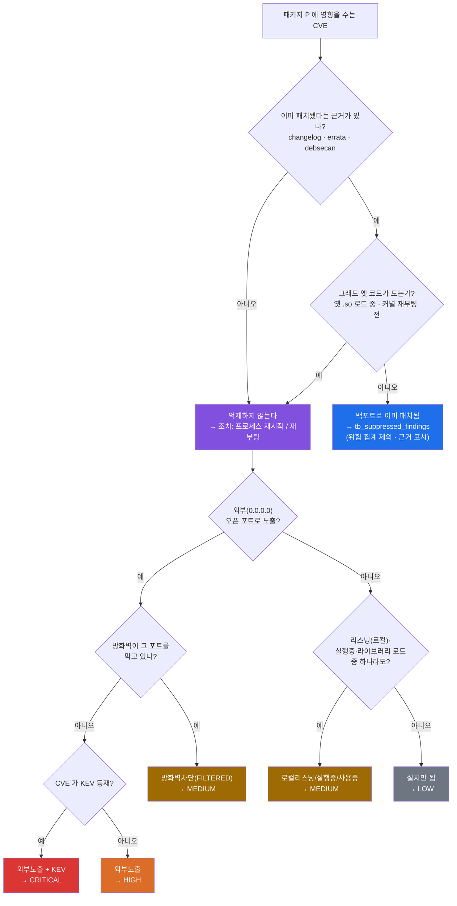
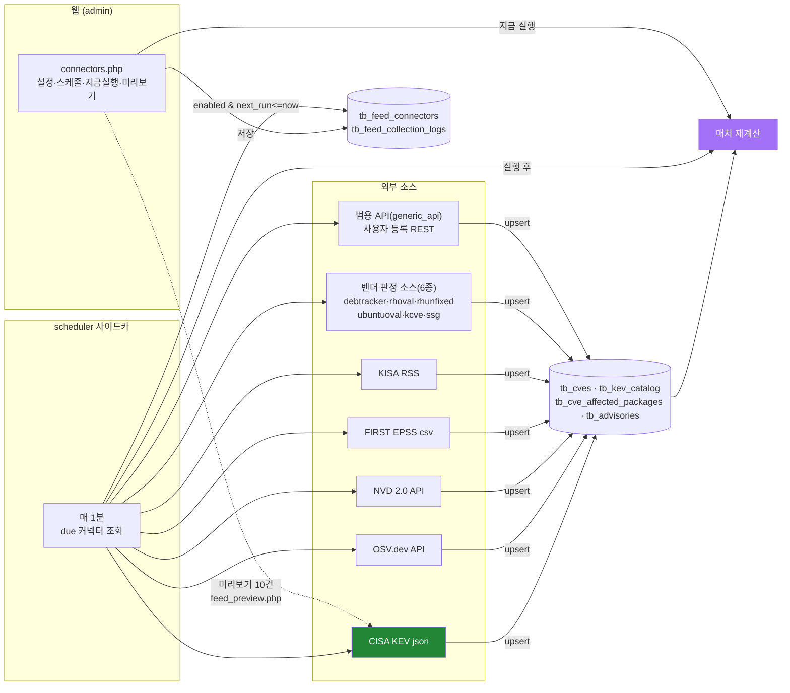
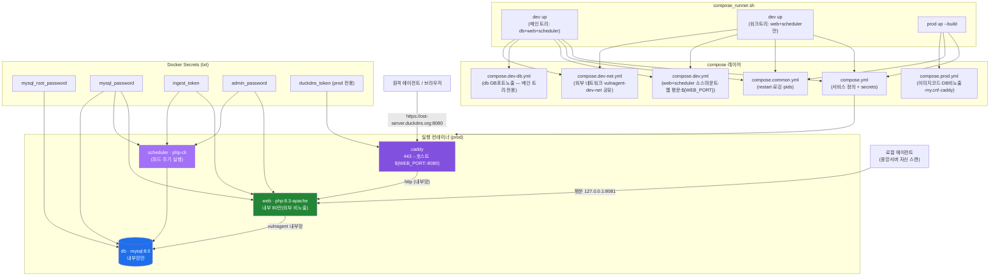
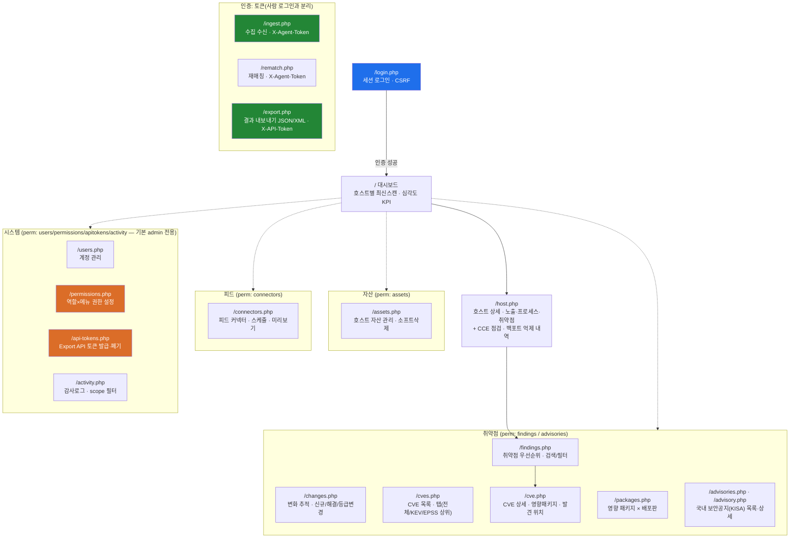

# vuln-agent 아키텍처

지금까지 확정·구현된 구조를 그림으로 정리한다. (Mermaid — GitHub에서 바로 렌더링)

관련 문서: 전략·로드맵은 [`../CONTEXT.md`](../CONTEXT.md), 실행법은 [`../README.md`](../README.md).

---

## 1. 시스템 개요 (데이터 흐름)

> 중앙 서버 자신을 모니터링하는 로컬 에이전트는 루프백 평문 포트(`127.0.0.1:8081`)로 Caddy 를
> 거치지 않고 직접 `ingest.php` 로 전송한다(§4 배포 구성 참고).

**핵심:** 매칭 정확도는 검증된 스캐너/피드에서 상속하고, 우리 기여는 그 위 레이어
(**런타임 노출 상관 · KEV/EPSS 우선순위 · 설명가능성**)에 둔다.

---

## 2. 매처 판정 로직 — "실제로 위험한가"

설치되었다고 전부 올리지 않는다. **런타임 상태(노출·실행·사용) + KEV** 로 우선순위를 가른다.
exposures(포트) + processes(실행/로드) 를 합쳐 6단계 상태를 판정한다(`vg_classify`).

> 상태: EXTERNAL > FILTERED ≈ LISTENING > RUNNING > LOADED > INSTALLED. KEV 시 한 단계 상향,
> EPSS·CVSS 는 같은 등급 내 정렬. 각 판정에 근거(어떤 프로세스·포트·라이브러리)가 남는다.
> **FILTERED** — 전체 인터페이스에 바인딩됐지만 방화벽(firewalld/ufw)이 그 포트를 막아 외부에서
> 못 닿는 경우다. 이 판정이 없으면 방화벽 뒤의 내부 서비스가 **전부 HIGH/CRITICAL 로 뜬다**(오탐).

**오탐 억제는 4겹이다(데비안 중심).** 배포판은 버전을 안 올리고 패치만 이식하므로 버전 비교만으로는 오탐이 난다.

| 겹 | 근거 테이블 | 판정 | 커버리지 |
|---|---|---|---|
| ① OSV 버전필터 | `tb_cve_affected_packages` | 배포판 전체버전 대조 → 영향 없으면 제거 | 전체 |
| ② changelog | `tb_pkg_changelog_cves` | 그 CVE 수정 기록이 있으면 억제 | 핵심 13개 패키지(하드코딩) |
| ③ errata | `tb_applied_errata` | 벤더가 "이 빌드에서 고쳤다"고 확인 → 억제 | **시스템 전체** |
| ④ debsecan | `tb_debsecan` | "아직 남은 CVE" 목록에 **없으면** 고쳐진 것 → 억제 | 데비안 전용 |

억제된 건은 `tb_findings` 가 아니라 `tb_suppressed_findings` 로 간다 — **기존 위험 집계·화면을
하나도 안 건드리고 오탐만 빠진다.** 숨기지 않고 호스트 상세에서 근거와 함께 보여준다(설명가능성).

> debsecan 은 방향이 반대(있는 게 아니라 **없는** 게 근거)라 안전장치를 두 겹 뒀다 —
> `os_id=debian` 일 때만 쓰고(우분투는 OSV 의 USN 경로로 커버), **목록이 비면 억제하지 않는다**
> (수집 실패와 "취약점 0"을 구분할 수 없어, 믿었다간 전부 억제해 버린다).

**RHEL 계열·우분투·커널은 각자의 벤더 소스로 별도 판정한다.** 위 4겹은 데비안 트래커 중심으로
자란 규칙이라, 배포판마다 조치 EVR 표기 방식이 다른 다른 벤더는 한 테이블로 합칠 수 없었다.

| 벤더 | 근거 테이블 | 판정 |
|---|---|---|
| RHEL 계열(Red Hat/AlmaLinux/Oracle) | `tb_vendor_errata`(OVAL 조치 EVR) + `tb_vendor_unfixed`(조치 불가) | 릴리스별 조치 EVR 대조, 수정본 없는 CVE 는 별도 API 로 확인 |
| 우분투 | `tb_ubuntu_oval` | 테스트에 조치 EVR 이 있으면 억제, 없으면 아직 수정본 없음(조치 불가) — 한 테이블에서 둘 다 표현 |
| 리눅스 커널(배포판 밖) | `tb_kernel_cves`(kernel.org CNA) | 구동 커널의 업스트림 버전과 스트림별 수정 버전 대조. 라즈베리·자체빌드처럼 배포판 트래커·OVAL 이 관할하지 않는 커널만 담당 |

벤더가 "아직 안 고쳤다"고 확인한 CVE 는 `tb_findings.no_fix` 로 표시한다 — **오탐 제거와는 다른
축**이다. 등급(런타임 노출 기준)은 그대로 두되, "지금 고칠 수 있는 것"과 "조치 불가"를 화면에서
분리해 조치 불가 수백 건이 고칠 수 있는 몇 건을 덮지 않게 한다.

**억제를 취소하는 두 신호 — "패치됨"이 곧 "안전함"은 아니다.**

- **재시작 필요**(`tb_stale_libs`): 패치됐지만 프로세스가 옛 `.so` 를 메모리에 물고 있으면 그
  프로세스는 여전히 옛 코드를 실행 중이다 → 억제하지 않고 근거(프로세스 → 라이브러리 경로)를 남긴다.
- **커널 재부팅 필요**(`tb_scans.kernel_reboot_needed`): 커널을 패치해도 재부팅 전엔 옛 커널이
  돈다 → 억제하지 않는다. 조치는 프로세스 재시작이 아니라 **재부팅**이라고 안내한다.

이 두 신호가 없으면 "설치 버전이 패치됨"만 보고 억제해 **미탐**이 된다.

**미지원 배포판.** Amazon Linux·Oracle Linux·CentOS 는 피드가 안 덮어 매칭이 0건이 된다.
조용히 "취약점 없음"으로 보이면 더 위험하므로 `vg_distro_unsupported`(`src/distro.php`)가 판정해
ingest 응답과 취약점 화면에 경고를 띄운다(자체 피드가 따로 필요하다는 뜻).

**보안설정 점검(CCE)** 은 별도 경로다. 같은 수집물의 `security`/`users` 섹션을 `src/cce.php` 가
판정해 `tb_cce_findings`(PASS/FAIL/NA)에 저장한다 — CVE 가 아니라 **설정**(SSH root 로그인,
패스워드 인증, UID 0 계정, SELinux/AppArmor, 방화벽)을 본다. 신규 수집은 하지 않는다.

---

## 3. CVE 피드 커넥터 (외부 소스 수집)

claude-pipeline 의 Connector/CollectionLog 패턴을 참고. UI에서 소스를 설정·스케줄하면
스케줄러가 주기적으로 당겨와 매처가 재계산한다.

커넥터 = `{type(11종 — 고정 5종 kev/osv/nvd/kisa/epss + 벤더판정 6종 debtracker/rhoval/rhunfixed/ssg/kcve/ubuntuoval + 범용 generic_api), connection(url·key·ecosystem 등 타입별), schedule, enabled}`.
스케줄은 **manual / interval(N분) / daily(HH:MM) / cron(5필드 표현식)** 지원 — UI에서 지정하면
스케줄러 사이드카가 매 tick(60s) 판정해 그 시각에 수집·재매칭한다(Quartz 유사, 중앙 실행).
수집 이력·상태는 `tb_feed_collection_logs` 에 남고 커넥터 행에 마지막 상태로 표시된다.

---

## 4. 배포 구성 (dev / prod)

> web·scheduler 는 같은 이미지(`vulnagent-app`)를 공유하고, 환경/시크릿은 compose 앵커
> (`x-app-env`/`x-app-secrets`)로 DRY 하게 재사용한다. dev 는 caddy 없이 `web` 을 `${WEB_PORT:-8080}`
> 으로 평문 직접 노출한다(§ Caddy README 참고: `deploy/caddy/README.md`).
>
> dev 는 web+scheduler 가 워크트리별 독립 컴포즈 프로젝트(`vulnagent-dev-<워크트리이름>`)로 뜨고,
> db 는 메인 트리 프로젝트(`vulnagent-dev`) 하나만 존재한다 — 서로 다른 프로젝트지만 외부 네트워크
> `vulnagent-dev-net`(`compose.dev-net.yml`)을 공유해 컨테이너명(`vulnagent-db-dev`)으로 붙는다.

| | dev | prod |
|---|---|---|
| 소스 | `./server` 라이브 마운트 | `../server` 읽기전용 마운트(PHP 는 배포=`git pull`, 무중단) |
| DB 포트 | 노출(3307) | 미노출(내부망만) |
| 웹 접속 | `http://localhost:8080` (평문) | `https://ost-server.duckdns.org:8080` (Caddy, 현재 자체서명) |
| my.cnf | 미적용(기본값) | 적용(charset/보안 튜닝) |
| 프로젝트 | `vulnagent-dev`(메인) · `vulnagent-dev-<워크트리>`(web+scheduler) | `vulnagent` |

각 대상 서버는 `agent/install-agent.sh` 로 systemd-timer(우선)/cron(폴백)을 등록해 기본
**매시간** 자동 수집·전송한다. 중앙 서버 자신을 스캔하는 로컬 에이전트만 루프백(`8081`)
평문 경로를 쓰고, 그 외 원격 서버 에이전트는 모두 Caddy 의 HTTPS 엔드포인트로 전송한다.

**스키마 적용**은 `deploy/migrate.sh` 가 맡는다 — `db/migrations/*.sql` 중 아직 안 든 것만
**파일명 사전순**으로 db 컨테이너에 파이프하고 `tb_schema_migrations(filename, applied_at)` 에
기록한다. 파일명은 타임스탬프(`YYYYMMDDHHMMSS_이름.sql`)다 — 연번은 동시에 작업하는 브랜치들이
같은 번호를 집어 충돌한다(실제로 `0003`·`0014` 가 각각 두 개 생겼다). 기존 연번 파일은 그대로
두는데, 사전순이라 `0…` 이 `2…` 보다 앞서 옛 파일이 먼저 도는 순서가 지켜진다.
`compose_runner.sh up` 과 `update.sh` 가 자동 호출하므로 수동 apply 가 필요 없다. 최상위
`db/*.sql` 은 **빈 볼륨 initdb 전용**이라 기존 볼륨엔 적용되지 않는다 — 증분 변경은 전부
`db/migrations/` 에 둔다.

---

## 5. 데이터 모델 (ERD)

> 아래는 **관계도**다. 테이블별 전체 컬럼·책임·정규화 현황은 `docs/데이터베이스.md` 참고.

```mermaid
erDiagram
    tb_hosts ||--o{ tb_scans : "수집 이력"
    tb_scans ||--o{ tb_packages : "설치 패키지"
    tb_scans ||--o{ tb_exposures : "노출 소켓(포트)"
    tb_scans ||--o{ tb_processes : "실행 프로세스"
    tb_scans ||--o{ tb_findings : "매처 판정"
    tb_scans ||--o{ tb_containers : "컨테이너 인벤토리"
    tb_containers ||--o{ tb_packages : "컨테이너 내부 패키지(container_id)"
    tb_scans ||--o{ tb_pkg_changelog_cves : "억제 근거② changelog"
    tb_scans ||--o{ tb_applied_errata : "억제 근거③ 벤더 권고"
    tb_scans ||--o{ tb_debsecan : "억제 근거④ 데비안 트래커(역방향)"
    tb_scans ||--o{ tb_stale_libs : "억제 취소 — 재시작 필요"
    tb_scans ||--o{ tb_suppressed_findings : "억제된 건"
    tb_scans ||--o{ tb_cce_findings : "보안설정 점검"
    tb_hosts ||--o{ tb_pkg_changes : "패키지 변화 이력"
    tb_cves  ||--o{ tb_cve_affected_packages : "영향 패키지"
    tb_cves  ||--o{ tb_findings : "취약점"
    tb_cves  ||--o| tb_kev_catalog : "KEV 등재"
    tb_feed_connectors ||--o{ tb_feed_collection_logs : "수집 이력"
    tb_users ||--o{ tb_activity_log : "행위 기록(느슨한 연계)"
    tb_users ||--o{ tb_api_tokens : "발급(Export API)"

    tb_hosts {
        bigint id PK
        string fqdn UK
        string os_id
        bool is_deleted
    }
    tb_scans {
        bigint id PK
        bigint host_id FK
        datetime collected_at
        int package_count
        int exposure_count
        bool is_deleted
    }
    tb_packages {
        bigint id PK
        bigint scan_id FK
        bigint container_id "호스트는 0, 컨테이너는 양수"
        string manager "dpkg rpm apk pip npm"
        string name
        string version
        string source_pkg
        string origin "출처 - 서드파티 판정"
    }
    tb_containers {
        bigint id PK
        bigint scan_id FK
        string cid
        string image
        string os_id
        string manager "dpkg apk rpm"
        int pkg_count
    }
    tb_stale_libs {
        bigint id PK
        bigint scan_id FK
        string comm "옛 so 를 문 프로세스"
        string package_name
        string lib_path
    }
    tb_applied_errata {
        bigint id PK
        bigint scan_id FK
        string package_name
        string cve_id
        string evidence "권고가 지목한 설치 NEVRA"
    }
    tb_debsecan {
        bigint id PK
        bigint scan_id FK
        string cve_id
        string package_name
    }
    tb_pkg_changes {
        bigint id PK
        bigint host_id FK
        bigint scan_id FK
        string package_name
        string change_type "installed removed upgraded downgraded"
        string old_version
        string new_version
    }
    tb_exposures {
        bigint id PK
        bigint scan_id FK
        string proc
        int port
        string scope
        string exe_pkg
        text loaded_pkgs
    }
    tb_processes {
        bigint id PK
        bigint scan_id FK
        string comm
        string exe_pkg
        text loaded_pkgs
    }
    tb_findings {
        bigint id PK
        bigint scan_id FK
        string cve_id FK
        string severity
        string runtime_status
        bool in_kev
    }
    tb_pkg_changelog_cves {
        bigint id PK
        bigint scan_id FK
        string package_name
        string cve_id
        string evidence
    }
    tb_suppressed_findings {
        bigint id PK
        bigint scan_id FK
        string cve_id
        string package_name
        string base_severity
        string suppress_reason
    }
    tb_cce_findings {
        bigint id PK
        bigint scan_id FK
        string code
        string result
        string severity
        string rationale
    }
    tb_cves {
        string cve_id PK
        decimal cvss
        decimal epss
        decimal epss_percentile
        bool is_deleted
    }
    tb_kev_catalog {
        string cve_id PK
        date date_added
    }
    tb_cve_affected_packages {
        bigint id PK
        string cve_id FK
        string package_name
        string fixed_version
    }
    tb_feed_connectors {
        bigint id PK
        string connector_type
        json connection_json
        json schedule_json
        bool enabled
        datetime next_run_at
        bool is_deleted
    }
    tb_feed_collection_logs {
        bigint id PK
        bigint connector_id FK
        string status
        int items_upserted
    }
    tb_advisories {
        bigint id PK
        string source
        string title
        string url UK
        date published
        string cve_ids
        bool is_deleted
    }
    tb_users {
        bigint id PK
        string username UK
        string password_hash
        string role
        bool is_deleted
    }
    tb_role_permissions {
        int id PK
        string role
        string menu_code
        bool allowed
    }
    tb_api_tokens {
        bigint id PK
        string label
        string token_hash UK
        string token_prefix
        datetime last_used_at
        bool is_deleted
    }
    tb_activity_log {
        bigint id PK
        bigint user_id
        string scope
        bigint scope_id
        string activity_type
        json data
        string ip_address
        datetime created_at
    }
```

*(tb_cves / tb_kev_catalog / tb_cve_affected_packages / tb_findings 는 2단계 매처, tb_feed_* 는
4a 피드 커넥터(connector_type: kev/osv/nvd/kisa/epss/debtracker/rhoval/rhunfixed/ssg/kcve/
ubuntuoval/generic_api), tb_advisories 는 4b KISA 국내공지,
tb_users 는 3단계 인증, tb_activity_log 는 감사 추적, tb_cce_findings 는 보안설정 점검,
tb_role_permissions 는 설정형 RBAC, tb_api_tokens 는 Export API 에서 도입.
**억제 계열**(§2): 근거는 tb_pkg_changelog_cves(②)·tb_applied_errata(③)·tb_debsecan(④),
억제 결과는 tb_suppressed_findings, **억제를 취소**하는 신호가 tb_stale_libs(재시작 필요).
tb_containers 는 컨테이너 인벤토리이고 컨테이너 내부 패키지는 tb_packages 에 `container_id>0` 으로
같이 들어간다(호스트는 0). tb_pkg_changes 는 패키지 변화 이력.
스키마 적용 이력은 `tb_schema_migrations`(deploy/migrate.sh).*
*모든 테이블에 감사 4컬럼(`created_at`/`updated_at`/`is_deleted`/`deleted_at`)이 통일되어 있다
(다이어그램엔 `is_deleted` 만 표기, 나머지 생략). 삭제는 하드삭제 대신 `vg_soft_delete()` 로
`is_deleted=1` 표시(대상: tb_users/tb_feed_connectors/tb_advisories/tb_hosts/tb_scans —
tb_findings 등 재계산 캐시성 테이블은 소프트삭제 대상에서 제외).*
*tb_advisories 는 CVE 와 느슨한 연계(제목의 CVE best-effort)라 FK 없음. tb_activity_log 는
`user_id` 가 NULL 가능(SYSTEM 행위, 예: ingest 수신)이라 FK 없이 논리적 연계만 유지)*

---

## 6. 웹 화면 구성 (사이트맵 · 인증)

좌측 사이드바가 대분류(대시보드/취약점/자산/피드/시스템)로 묶고, **역할×메뉴 권한**에서 허용된
링크만 렌더한다(링크가 하나도 안 남은 섹션은 라벨째 숨김).

- **세션 인증**(`tb_users`) : 웹 화면 전부. 역할은 **`admin` / `operator` / `user`** 3단계.
- **설정형 RBAC**: `admin` 은 코드에서 항상 전체 허용(잠금 방지)이라 권한 행을 두지 않는다.
  `operator`·`user` 는 **역할 × 메뉴코드**(dashboard/findings/advisories/assets/connectors/
  users/permissions/agenttokens/apitokens/activity) 허용 여부를 `tb_role_permissions` 에 두고 `/permissions.php`
  에서 켜고 끈다. 각 페이지 가드는 `vg_require_menu('<메뉴코드>')` 하나로 통일.
  기본 시드 — operator: 대시보드/취약점/공지/자산/피드 허용, 시스템 불가. user: 대시보드/취약점/공지만.
- **토큰 인증**(사람 로그인과 분리):
  - 에이전트 → `ingest.php` : **호스트별 개별 토큰**(`X-Agent-Token`). `/agent-tokens.php` 에서
    호스트(fqdn)마다 발급하고, 토큰은 발급 시 정한 fqdn 만 갱신할 수 있다 — `ingest.php` 가
    바인딩을 강제해, 본문이 다른 호스트를 주장하면 **403 으로 거부**(침해된 대상 1대가 남의
    스캔을 위조·덮어쓰는 것을 차단). DB 엔 SHA-256 해시만 저장(원문 1회 표시), 폐기는 `is_revoked`.
    활성 토큰은 호스트당 하나(재발급 시 기존분 자동 폐기). **하위호환**: 구버전 공유 토큰
    (`secrets/ingest_token.txt`)도 당분간 받되(본문 fqdn 사용) deprecated — 수신 시 감사 로그에 경고.
  - 에이전트 → `rematch.php` : 공유 시크릿 `X-Agent-Token`(`secrets/ingest_token.txt`).
  - 외부 시스템 → `export.php` : 웹에서 발급하는 **읽기 전용** API 토큰(`X-API-Token`, 또는
    `Authorization: Bearer`). DB 엔 SHA-256 해시만 저장(원문은 발급 시 1회 표시), 폐기는 소프트삭제.
- 최초 admin 은 `secrets/admin_password` 로 부트스트랩.
- **감사 로깅**: 로그인·커넥터 저장/토글/삭제·사용자 추가/삭제·ingest 수신이 `tb_activity_log` 에
  자동 기록된다(`server/src/audit.php` 의 `vg_log_activity()`, 각 페이지가 require 해서 호출).
  `/activity.php` 에서 scope 필터 + 페이지네이션으로 조회한다.
- **소프트 삭제**: `vg_soft_delete()` 가 하드 DELETE 대신 `is_deleted/deleted_at` 를 세운다.
  화이트리스트 대상: `tb_users`/`tb_feed_connectors`/`tb_advisories`/`tb_hosts`/`tb_scans`.
