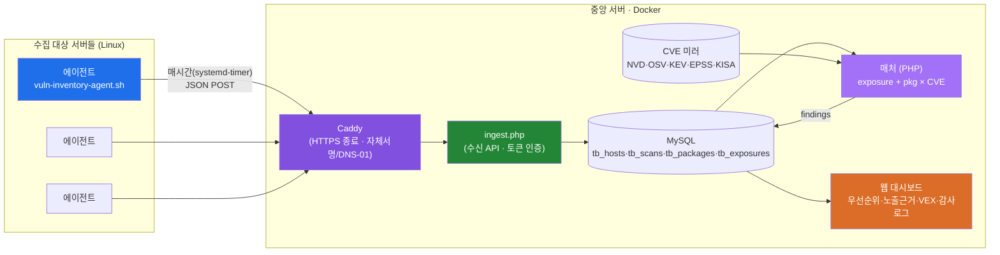
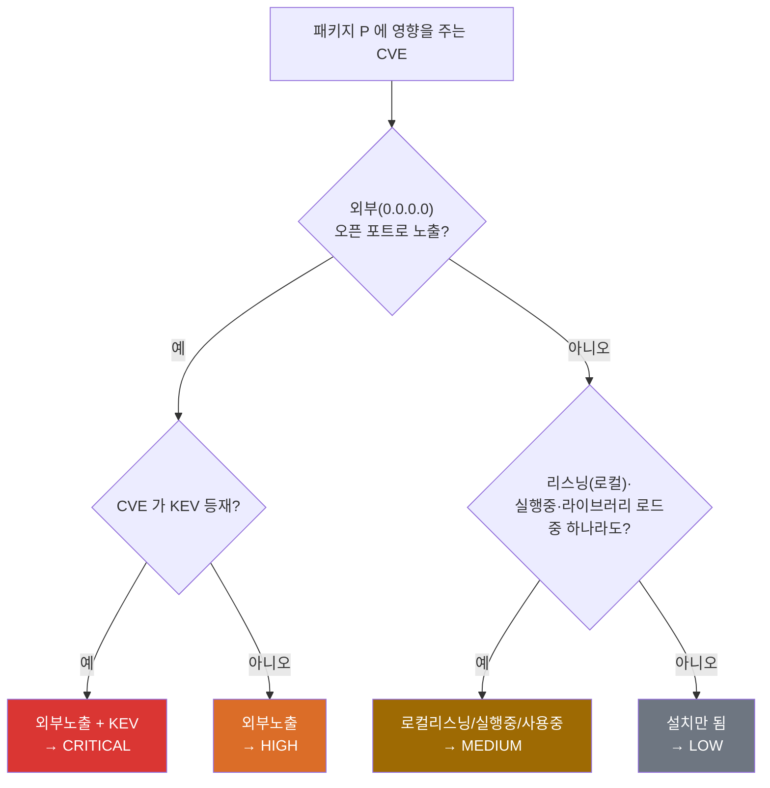
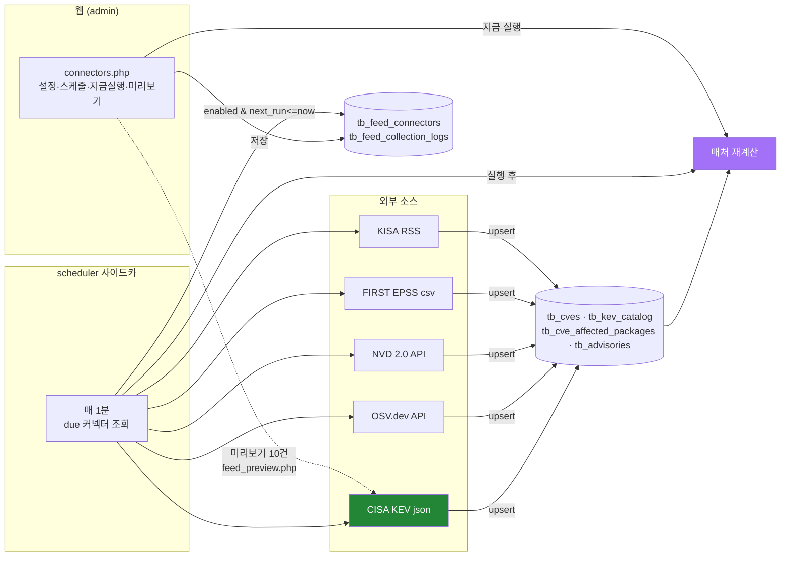
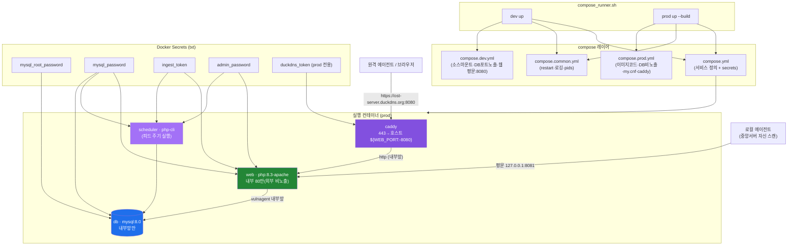
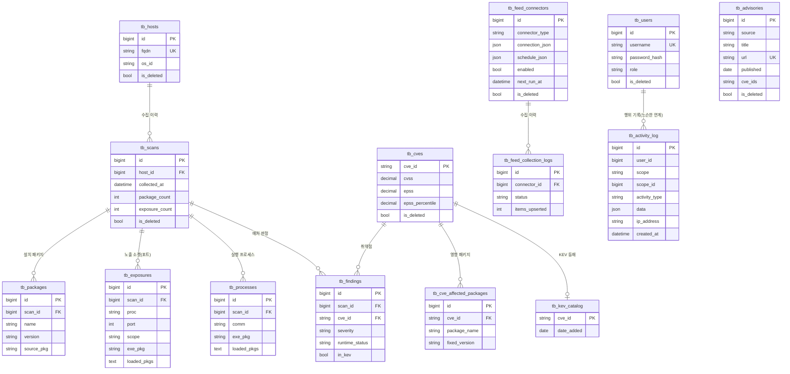
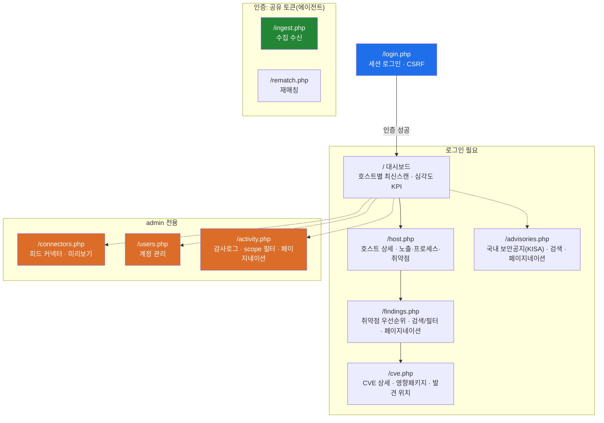

# vuln-agent 아키텍처

지금까지 확정·구현된 구조를 그림으로 정리한다. (Mermaid — GitHub에서 바로 렌더링)

관련 문서: 전략·로드맵은 [`../CONTEXT.md`](../CONTEXT.md), 실행법은 [`../README.md`](../README.md).

---

## 1. 시스템 개요 (데이터 흐름)

> 중앙 서버 자신을 모니터링하는 로컬 에이전트는 루프백 평문 포트(`127.0.0.1:8081`)로 Caddy 를
> 거치지 않고 직접 `ingest.php` 로 전송한다(§4 배포 구성 참고).

**핵심:** 매칭 정확도는 검증된 스캐너/피드에서 상속하고, 우리 기여는 그 위 레이어
(**런타임 노출 상관 · KEV/EPSS 우선순위 · 설명가능성**)에 둔다.

---

## 2. 매처 판정 로직 — "실제로 위험한가"

설치되었다고 전부 올리지 않는다. **런타임 상태(노출·실행·사용) + KEV** 로 우선순위를 가른다.
exposures(포트) + processes(실행/로드) 를 합쳐 5단계 상태를 판정한다.

> 상태: EXTERNAL > LISTENING > RUNNING > LOADED > INSTALLED. KEV 시 한 단계 상향,
> EPSS·CVSS 는 같은 등급 내 정렬. 각 판정에 근거(어떤 프로세스·포트·라이브러리)가 남는다.
> 백포트 오탐은 OSV 버전필터(배포판 전체버전 대조)가 이미 제거.

---

## 3. CVE 피드 커넥터 (외부 소스 수집)

claude-pipeline 의 Connector/CollectionLog 패턴을 참고. UI에서 소스를 설정·스케줄하면
스케줄러가 주기적으로 당겨와 매처가 재계산한다.

커넥터 = `{type(kev/osv/nvd/kisa/epss), connection(url·key·ecosystem), schedule, enabled}`.
스케줄은 **manual / interval(N분) / daily(HH:MM) / cron(5필드 표현식)** 지원 — UI에서 지정하면
스케줄러 사이드카가 매 tick(60s) 판정해 그 시각에 수집·재매칭한다(Quartz 유사, 중앙 실행).
수집 이력·상태는 `tb_feed_collection_logs` 에 남고 커넥터 행에 마지막 상태로 표시된다.

---

## 4. 배포 구성 (dev / prod)

> web·scheduler 는 같은 이미지(`vulnagent-app`)를 공유하고, 환경/시크릿은 compose 앵커
> (`x-app-env`/`x-app-secrets`)로 DRY 하게 재사용한다. dev 는 caddy 없이 `web` 을 `${WEB_PORT:-8080}`
> 으로 평문 직접 노출한다(§ Caddy README 참고: `caddy/README.md`).

| | dev | prod |
|---|---|---|
| 소스 | `./server` 라이브 마운트 | 이미지에 구움(배포=재빌드) |
| DB 포트 | 노출(3307) | 미노출(내부망만) |
| 웹 접속 | `http://localhost:8080` (평문) | `https://ost-server.duckdns.org:8080` (Caddy, 현재 자체서명) |
| my.cnf | 미적용(기본값) | 적용(charset/보안 튜닝) |
| 프로젝트 | `vulnagent-dev` | `vulnagent` |

각 대상 서버는 `agent/install-agent.sh` 로 systemd-timer(우선)/cron(폴백)을 등록해 기본
**매시간** 자동 수집·전송한다. 중앙 서버 자신을 스캔하는 로컬 에이전트만 루프백(`8081`)
평문 경로를 쓰고, 그 외 원격 서버 에이전트는 모두 Caddy 의 HTTPS 엔드포인트로 전송한다.

---

## 5. 데이터 모델 (ERD)

*(tb_cves / tb_kev_catalog / tb_cve_affected_packages / tb_findings 는 2단계 매처, tb_feed_* 는
4a 피드 커넥터(connector_type: kev/osv/nvd/kisa/epss), tb_advisories 는 4b KISA 국내공지,
tb_users 는 3단계 인증, tb_activity_log 는 감사 추적에서 도입.*
*모든 테이블에 감사 4컬럼(`created_at`/`updated_at`/`is_deleted`/`deleted_at`)이 통일되어 있다
(다이어그램엔 `is_deleted` 만 표기, 나머지 생략). 삭제는 하드삭제 대신 `vg_soft_delete()` 로
`is_deleted=1` 표시(대상: tb_users/tb_feed_connectors/tb_advisories/tb_hosts/tb_scans —
tb_findings 등 재계산 캐시성 테이블은 소프트삭제 대상에서 제외).*
*tb_advisories 는 CVE 와 느슨한 연계(제목의 CVE best-effort)라 FK 없음. tb_activity_log 는
`user_id` 가 NULL 가능(SYSTEM 행위, 예: ingest 수신)이라 FK 없이 논리적 연계만 유지)*

---

## 6. 웹 화면 구성 (사이트맵 · 인증)

- **세션 인증**(users 테이블) : 대시보드·호스트상세·취약점·CVE상세·국내공지. admin 은 피드·사용자·감사로그.
- **토큰 인증**(공유 시크릿) : 에이전트가 쓰는 `ingest.php`/`rematch.php` — 사람 로그인과 분리.
- 역할: `admin`(관리) / `viewer`(조회). 최초 admin 은 `secrets/admin_password` 로 부트스트랩.
  admin 전용 페이지는 `vg_require_admin()` 으로 통일 가드.
- **감사 로깅**: 로그인·커넥터 저장/토글/삭제·사용자 추가/삭제·ingest 수신이 `tb_activity_log` 에
  자동 기록된다(`server/src/audit.php` 의 `vg_log_activity()`, 각 페이지가 require 해서 호출).
  `/activity.php`(admin 전용)에서 scope 필터 + 페이지네이션으로 조회한다.
- **소프트 삭제**: `vg_soft_delete()` 가 하드 DELETE 대신 `is_deleted/deleted_at` 를 세운다.
  화이트리스트 대상: `tb_users`/`tb_feed_connectors`/`tb_advisories`/`tb_hosts`/`tb_scans`.
