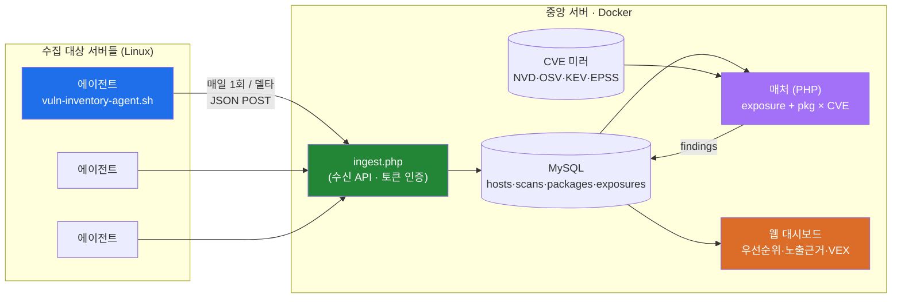
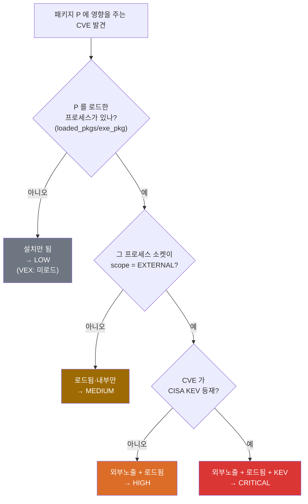
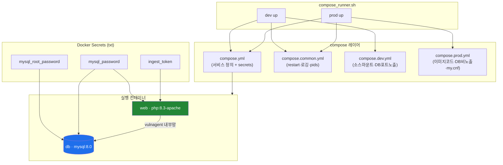
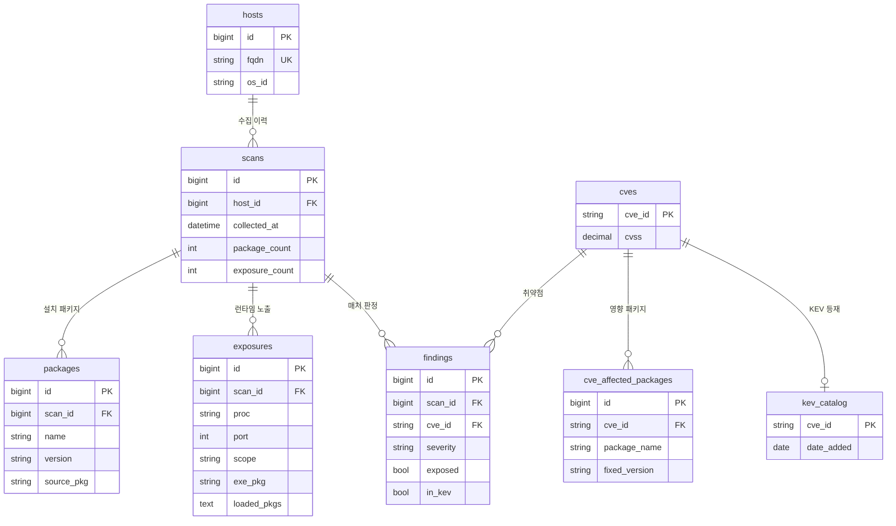

# vuln-agent 아키텍처

지금까지 확정·구현된 구조를 그림으로 정리한다. (Mermaid — GitHub에서 바로 렌더링)

관련 문서: 전략·로드맵은 [`../CONTEXT.md`](../CONTEXT.md), 실행법은 [`../README.md`](../README.md).

---

## 1. 시스템 개요 (데이터 흐름)

**핵심:** 매칭 정확도는 검증된 스캐너/피드에서 상속하고, 우리 기여는 그 위 레이어
(**런타임 노출 상관 · KEV/EPSS 우선순위 · 설명가능성**)에 둔다.

---

## 2. 매처 판정 로직 — "실제로 위험한가"

설치되었다고 전부 올리지 않는다. **노출·로드 여부 + KEV** 로 우선순위를 가른다.

> 보안 권고로 이미 백포트 패치된 경우 → 해당 없음(VEX 근거 기록). 각 판정에는
> "왜 이 등급인가"의 근거(노출 소켓·로드 라이브러리·KEV 여부)가 함께 남는다.

---

## 3. 배포 구성 (dev / prod)

| | dev | prod |
|---|---|---|
| 소스 | `./server` 라이브 마운트 | 이미지에 구움(배포=재빌드) |
| DB 포트 | 노출(3307) | 미노출(내부망만) |
| my.cnf | 미적용(기본값) | 적용(charset/보안 튜닝) |
| 프로젝트 | `vulnagent-dev` | `vulnagent` |

---

## 4. 데이터 모델 (ERD)

*(cves / kev_catalog / cve_affected_packages / findings 는 2단계 매처에서 도입)*
