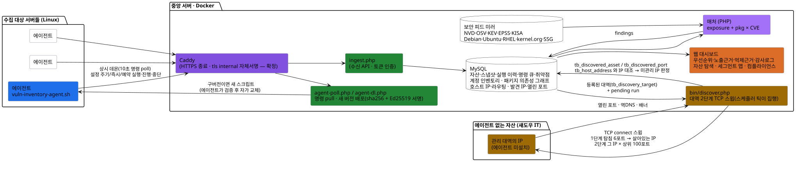
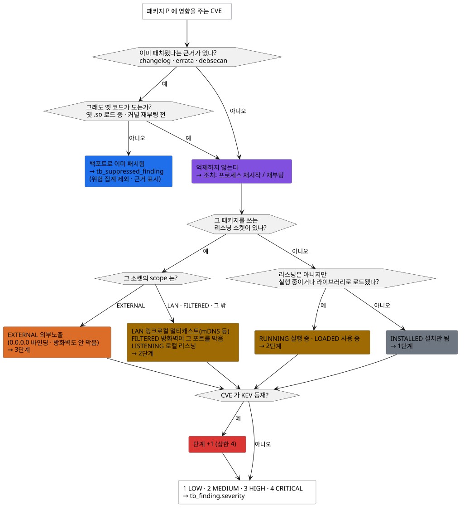
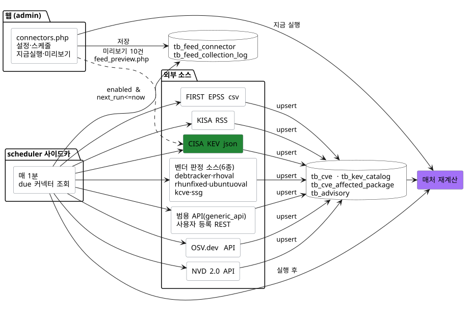
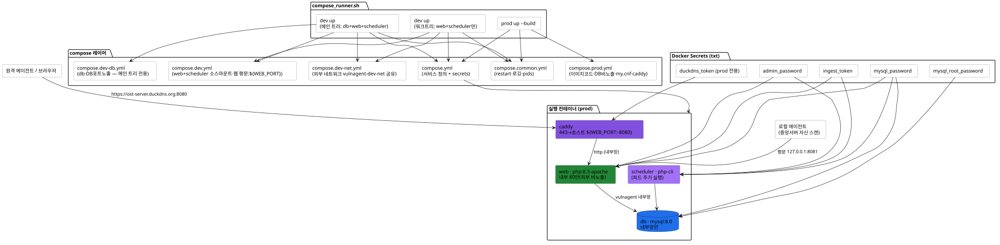
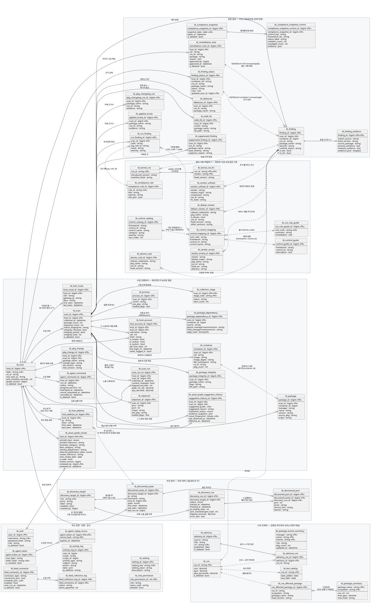
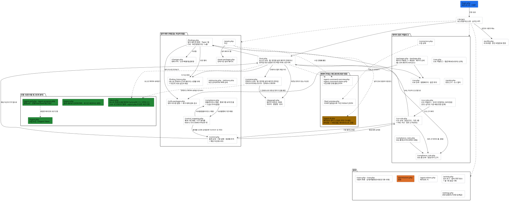

# vuln-agent 아키텍처

> **현행 기준: 2026-08-24**(`main` ef5db37) · 에이전트 3.23 · 피드 커넥터 11종 가동(+ pkgregistry 미시드, 코드는 12종 지원) ·
> CCE 39항목 · 기반시설 U-코드 72항목 · 도메인 테이블 61개.
> 이 기준일까지 무엇이 들어왔는지(단계별 현황)는 [`CONTEXT.md`](../../CONTEXT.md).

지금까지 확정·구현된 구조를 정리한다. 다이어그램 원본은
[`docs/specs/diagrams/`](../specs/diagrams/) 의 PlantUML(`.puml`)이고, 각 절 첫머리에
렌더된 `.svg` 를 인라인한다(클릭하면 원본 크기).

**여기 없는 것 — 정본이 따로 있다.** 같은 내용을 두 벌로 두지 않는다.

| 알고 싶은 것 | 정본 |
|---|---|
| 전략·로드맵·현재 단계 | [`CONTEXT.md`](../../CONTEXT.md) |
| 실행법·빠른 시작 | [`README.md`](../../README.md) |
| 테이블별 컬럼·정규화 현황 | [`데이터베이스.md`](데이터베이스.md) |
| 화면별 배경·사용법 | [`화면-안내.md`](화면-안내.md) |
| 에이전트 설치·운용·수집 항목 | [`agent/README.md`](../../agent/README.md) |
| 피드 소스별 역할 | [`피드소스-역할.md`](피드소스-역할.md) |
| 설정 항목 레퍼런스 | [`docs/ui-configuration.md`](../ui-configuration.md) |

**절 목차**(서브섹션은 각 절 안에) — [1 시스템 개요](#1-시스템-개요-데이터-흐름) ·
[2 매처 판정 로직](#2-매처-판정-로직--실제로-위험한가) ·
[3 CVE 피드 커넥터](#3-cve-피드-커넥터-외부-소스-수집) · [4 배포 구성](#4-배포-구성-dev--prod) ·
[5 데이터 모델(ERD)](#5-데이터-모델-erd) · [6 웹 화면 구성](#6-웹-화면-구성-사이트맵--인증)

---

## 1. 시스템 개요 (데이터 흐름)

**핵심:** 매칭 정확도는 검증된 스캐너/피드에서 상속하고, 우리 기여는 그 위 레이어
(**런타임 노출 상관 · KEV/EPSS 우선순위 · 설명가능성**)에 둔다. 중앙 서버 자신을 모니터링하는
로컬 에이전트만 Caddy 를 거치지 않고 루프백 평문 포트로 직접 보낸다(§4.1).

### 1.1 파이프라인은 둘이다

Nexpose·Nessus 의 Discovery / Vulnerability 분리와 같은 구도다.

| 파이프라인 | 입력 | 답하는 질문 | 두 파이프라인의 접점 |
|---|---|---|---|
| **취약점**(§2·§3) | 에이전트 수집물 + 외부 피드 | "설치된 것 중 **실제로 위험한** 게 뭔가" | 발견 IP ↔ 우리가 아는 IP(`tb_host_address`) 대조 한 곳뿐 — `tb_discovered_asset.host_id` |
| **자산 탐색**(§1.2) | 등록된 관리 대역 | "내가 **모르는 자산**이 몇 대인가" | 〃 |

### 1.2 자산 탐색 (섀도우 IT)

에이전트를 설치한 서버만 아는 상태로는 담당자가 대장에서 빠뜨린 자산을 구조적으로 못 찾는다.
관리 대역(`tb_discovery_target`)을 등록하면 중앙이 병렬 TCP connect 로 훑어 에이전트 미설치 IP 를
찾는다(`server/src/discovery.php` → `tb_discovery_run`·`tb_discovered_asset`·`tb_discovered_port`).
화면 `/discovery.php`(자산 서브탭)의 어휘·인가·강화 한계는 [`화면-안내.md`](화면-안내.md).

- **2단계 스윕**: 탐침 포트 몇 개로 살아있는 IP 만 추리고(`/24` 면 254×6=1,524 조합), 통과한 IP 에만
  전체 포트를 던진다. 총 실행시간은 **죽은 IP 의 타임아웃**이 지배해서 전조합(25,400)은 못 쓴다.
  OS 추정·UDP 스캔·재시도·MAC 수집은 하지 않는다.
- **한 프로세스로 끝낸다**: `STREAM_CLIENT_ASYNC_CONNECT` + `stream_select()` 로 수백 소켓을
  한꺼번에 들어 소켓 회수 지점을 한 곳에 둔다.
- **웹은 스캔을 직접 돌리지 않는다.** 화면은 `pending` 행만 만들고 집행은 **스케줄러 틱**(이전 실행
  종료 후 60초 뒤 재실행)이나
  `server/bin/discover.php --pending` 이 `vg_discovery_run_pending()` 한 함수로 한다 — 수백 소켓을
  수십 초 드는 작업이라 웹 요청에서 돌리면 요청이 그만큼 묶인다. 한 틱의 집행량엔 상한이 있어
  (기본 1건·45초) 수집 틱을 굶기지 않는다. 예전엔 집행하는 곳이 아예 없어 "대역 탐색"이 영원히
  대기했다.

### 1.3 세그먼트 맵

에이전트는 예전부터 라우팅 원문(`ip route`)을 보내 왔지만 그 값은 `tb_scan.raw_json` 안에만 있고
어떤 테이블로도 파싱되지 않았다. 지금은 ingest 가 `tb_host_route` 에 넣고
(`server/bin/backfill_host_route.php` 가 기존 스캔을 백필), `/segment-map.php` 가 대역별 카드로
망 구조를 그린다 — **"우리 망이 어떻게 생겼나."**

**A단계까지만 그린다.** 라우팅으로 되는 것(게이트웨이 아래 어떤 대역, 그 대역에 어떤 자산)까지다.
실제 트래픽 엣지(서버→DB)는 에이전트가 연결 상대를 수집해야 하는 B단계이고 데이터가 없어 만들지
않는다 — 없는 것을 그럴듯하게 채우면 틀린 그림을 사실처럼 보여준다. 그래프 레이아웃 엔진
(d3-force·cytoscape)도 들이지 않는다: 지금 데이터는 "게이트웨이 하나 아래 호스트 여럿"인 성형(star)
구조뿐이라 자산 상세의 컨테이너 계층 카드를 그대로 쓴다. 카드 구성과 예외 처리는
[`화면-안내.md`](화면-안내.md).

---

## 2. 매처 판정 로직 — "실제로 위험한가"

설치되었다고 전부 올리지 않는다. **런타임 상태(노출·실행·사용) + KEV** 로 우선순위를 가른다.

### 2.1 런타임 노출 7단계

exposures(포트) + processes(실행/로드) 를 합쳐 7단계 상태를 판정한다(`vg_classify` —
`server/src/matcher/classify.php`). 각 판정에 근거(어떤 프로세스·어떤 포트·어떤 라이브러리)가
문장으로 남는다(설명가능성).

| 상태 | 뜻 | 레벨 |
|---|---|---|
| `EXTERNAL` | 외부에서 닿는 포트를 그 패키지가 쓴다 | 3 (HIGH) |
| `LAN` | 링크로컬 멀티캐스트(mDNS/LLMNR/SSDP). `0.0.0.0` 이어도 라우터를 못 넘어 같은 세그먼트만 닿는다 → EXTERNAL 로 올리지 않는다 | 2 |
| `FILTERED` | 전체 인터페이스 바인딩이지만 방화벽(firewalld/ufw)이 그 포트를 막았다. **이 판정이 없으면 방화벽 뒤 내부 서비스가 전부 HIGH/CRITICAL 로 뜬다**(오탐) | 2 |
| `LISTENING` | 위 어디에도 안 드는 로컬 리스닝 소켓 | 2 |
| `RUNNING` | 프로세스가 실행 중(포트 미개방) | 2 |
| `LOADED` | 실행 프로세스가 그 라이브러리를 적재 중 | 2 |
| `INSTALLED` | 설치만 됨(실행·로드 프로세스 없음) | 1 (LOW) |

레벨 1/2/3/4 = LOW/MEDIUM/HIGH/CRITICAL 이고 **KEV 등재면 한 단계 상향**(최대 CRITICAL).
EPSS·CVSS 는 같은 등급 안의 정렬에만 쓴다.

### 2.2 오탐 억제는 4겹이다 (데비안 중심)

배포판은 버전을 안 올리고 패치만 이식하므로 버전 비교만으로는 오탐이 난다.

| 겹 | 근거 테이블 | 판정 | 커버리지 |
|---|---|---|---|
| ① OSV 버전필터 | `tb_cve_affected_package` | 배포판 전체버전 대조 → 영향 없으면 제거 | 전체 |
| ② changelog | `tb_pkg_changelog_cve` | 그 CVE 수정 기록이 있으면 억제 | 핵심 13개 패키지(하드코딩) |
| ③ errata | `tb_applied_errata` | 벤더가 "이 빌드에서 고쳤다"고 확인 → 억제 | **시스템 전체** |
| ④ debsecan | `tb_debsecan` | "아직 남은 CVE" 목록에 **없으면** 고쳐진 것 → 억제 | 데비안 전용 |

억제된 건은 `tb_finding` 이 아니라 `tb_suppressed_finding` 으로 간다 — **기존 위험 집계·화면을 하나도
안 건드리고 오탐만 빠진다.** 숨기지 않고 호스트 상세에서 근거와 함께 보여준다. debsecan 만은 방향이
반대(있는 게 아니라 **없는** 게 근거)라 안전장치를 두 겹 뒀다 — `os_id=debian` 일 때만 쓰고(우분투는
OSV 의 USN 경로로 커버), **목록이 비면 억제하지 않는다**(수집 실패와 "취약점 0"을 구분할 수 없어,
믿었다간 전부 억제해 버린다).

### 2.3 벤더별 판정 — 한 테이블로 합칠 수 없었다

위 4겹은 데비안 트래커 중심으로 자란 규칙이라, 조치 EVR 표기 방식이 다른 벤더는 따로 판정한다.

| 벤더 | 근거 테이블 | 판정 |
|---|---|---|
| RHEL 계열(Red Hat/AlmaLinux/Oracle) | `tb_vendor_errata`(OVAL 조치 EVR) + `tb_vendor_unfixed`(조치 불가) | 릴리스별 조치 EVR 대조, 수정본 없는 CVE 는 별도 API 로 확인 |
| 우분투 | `tb_ubuntu_oval` | 테스트에 조치 EVR 이 있으면 억제, 없으면 아직 수정본 없음(조치 불가) — 한 테이블에서 둘 다 표현 |
| 리눅스 커널(배포판 밖) | `tb_kernel_cve` / `tb_kernel_cve_fix`(kernel.org CNA) | 구동 커널의 업스트림 버전과 스트림별 수정 버전 대조. 라즈베리·자체빌드처럼 배포판 트래커·OVAL 이 관할하지 않는 커널만 담당 |

벤더가 "아직 안 고쳤다"고 확인한 CVE 는 `tb_finding.no_fix` 로 표시한다 — **오탐 제거와는 다른 축**
이다. 등급(런타임 노출 기준)은 그대로 두되 "지금 고칠 수 있는 것"과 "조치 불가"를 화면에서 분리해,
조치 불가 수백 건이 고칠 수 있는 몇 건을 덮지 않게 한다.

**미지원 배포판.** Amazon Linux·CentOS 는 피드가 안 덮어 매칭이 0건이 되는데 조용히 "취약점 없음"
으로 보이면 더 위험하므로, `vg_distro_unsupported`(`server/src/distro.php`)가 판정해 ingest 응답과
취약점 화면에 경고를 띄운다(자체 피드가 필요하다는 뜻). Oracle Linux 는 OSV 대신 Oracle ELSA OVAL
커넥터가 릴리스별 영향 여부와 수정 EVR 을 제공한다.

### 2.4 억제를 취소하는 두 신호 — "패치됨"이 곧 "안전함"은 아니다

| 신호 | 근거 | 왜 억제하지 않나 | 안내하는 조치 |
|---|---|---|---|
| 재시작 필요 | `tb_stale_lib` | 패치됐어도 프로세스가 옛 `.so` 를 메모리에 물고 있으면 여전히 옛 코드를 실행 중이다 | 프로세스 재시작(근거: 프로세스 → 라이브러리 경로) |
| 커널 재부팅 필요 | `tb_scan.kernel_reboot_needed` | 커널을 패치해도 재부팅 전엔 옛 커널이 돈다 | **재부팅**(프로세스 재시작이 아니다) |

이 두 신호가 없으면 "설치 버전이 패치됨"만 보고 억제해 **미탐**이 된다.

### 2.5 재매칭 — 결과가 같으면 아무것도 쓰지 않는다

피드가 갱신돼도 특정 스캔의 판정 결과는 대부분 그대로인데, 예전엔 1비트도 안 바뀐 경우까지
`tb_finding`/`tb_suppressed_finding` 를 통째 삭제·재삽입해 **binlog 가 하루 20GB 넘게** 쌓였다(운영
실측: 디스크 105G 중 76G). 지금은 `vg_match_scan()`(`server/src/matcher.php`)이 판정을 전부 메모리
에서 끝낸 뒤 결과 지문(sha1)을 `tb_scan.match_fingerprint` 와 비교해 같으면 트랜잭션조차 열지 않고,
다르면 통째 재작성하며 같은 트랜잭션 안에서 지문을 갱신한다(행 단위 diff 로 하지 않는다 — 비교
컬럼을 하나 빠뜨리면 stale 값이 영구히 남는다).

> **판정 로직이나 저장 컬럼을 바꾸면 `VG_MATCH_FP_VERSION`(`server/src/matcher.php`)을 올려야 한다.**
> 입력이 같으면 지문도 같아 **새 코드로 재계산한 결과가 영영 저장되지 않는** 함정이 있다. 이 상수는
> 지문에 섞여 들어가므로 올리면 전 스캔이 한 번씩 다시 쓰인다. 재매칭은 피드 수집·에이전트 수집
> 경로가 내부에서 직접 걸고, 외부에서 전체 스캔을 강제로 다시 쓰는 공개 API 는 제공하지 않는다.

### 2.6 보안설정 점검(CCE)과 기준 매핑

CVE 가 아니라 **설정**을 본다. 같은 수집물의 `security`/`users` 섹션을 `server/src/cce.php`(진입점,
실제 판정은 `server/src/cce/checks/`)가 판정해 `tb_cce_finding`(PASS/FAIL/NA)에 저장한다.
**신규 수집은 하지 않는다.** 점검 항목 **39개**(SSH·계정·패스워드 정책·파일 권한·MAC/방화벽 +
시간동기화 `CCE-TIME-*`·로그설정 `CCE-LOG-*`·암호화 `CCE-CRYPTO-*`)의 정본은
`vg_cce_rules()`(`server/src/cce/catalog.php`)이고 판정 함수에서 뽑아 쓴다 — 목록을 따로 적으면
판정과 어긋난다. 31개는 SSG 룰 ID 에 묶이고 나머지 8개는 화면에서 "자체 기준"으로
드러낸다(`vg_cce_ssg_map()`).

**기준 매핑은 두 표가 역할을 나눠 갖는다.** 헷갈리면 화면이 서로 다른 질문에 답하게 된다.

| 표 | 답하는 질문 | 조회·화면 |
|---|---|---|
| `tb_control_mapping` | "이 CCE 결과는 **어느 기준의 증적**인가"(U-코드·ISMS-P·N2SF 다중 매핑) | `server/src/control_mapping.php` · `/control_mapping.php` |
| `tb_control_catalog` | "**기준 전체 중 우리가 몇 개를 덮나**" — 기반시설 U-코드 **72개를 분모**로 세운다 | `/kisa-u.php` |

매핑 행 자체가 마이그레이션 시드이고 **근거가 없으면 행을 만들지 않는다**(억지 매핑 금지, 카탈로그
정본은 `db/migrations/20260818221235_kisa_u_catalog.sql`). `tb_control_mapping` 은 `rule_code` 가
NOT NULL 이라 **우리가 점검하지 않는 U-코드는 행이 아예 없어** 커버리지를 답할 수 없었다 — 카탈로그가
분모를 세우고 매핑을 왼쪽 조인해 **덮이지 않은 항목까지 센다**(현재 72개 중 21개 매핑 / 51개 공백).
**빈 칸이 드러나는 것이 이 화면의 값**이라 미점검 항목을 숨기거나 준수로 보이게 하지 않는다.

### 2.7 CVE 와 별개인 네 축

CVE 매칭 밖에서 따로 답하는 축들이다. 판정 기준이 다르니 위험 집계에도 섞지 않는다.

| 축 | 무엇을 보나 | 저장 | 핵심 규칙 |
|---|---|---|---|
| **계정 인벤토리** | 계정 "설정 정책"이 아니라 **실제 계정 목록** — 이게 없어 ISMS-P 2.5.x·N2SF AC 계정관리가 통째로 공백이었다 | `server/src/account_inventory.php` 가 에이전트의 `users` 섹션을 계정 1행으로 조립해 `tb_host_account` 에 저장하고 파생 판정을 계산 | 원칙은 CCE 와 같다 — **패스워드 해시는 받지도 저장하지도 않고**, `/etc/shadow`·sudoers 를 못 읽은 값(NULL)은 정상(PASS)이 아니라 **판정 불가(NA)** 이며, 공유계정·퇴직자 계정 추정은 FAIL 이 아니라 REVIEW(사람이 확인)다 |
| **패키지 무결성** | "설치 이후 파일이 바뀌었나"(N2SF 제6장 IN 구성요소 무결성) | 행은 `tb_package_integrity`(스캔 CASCADE), **검사 여부·부분 결과·전체 건수는 `tb_scan.integrity_checked`/`_partial`/`_total`** | 행 0개만으로는 "검사했는데 깨끗함"과 "아예 검사 안 함"을 구분할 수 없고, 합치면 "검사도 안 했는데 깨끗하다"로 읽힌다. 어휘도 "변조됨"이 아니라 **"패키지 원본과 다름(관측)"** — 운영자가 직접 바꾼 파일일 수 있다 |
| **미조치 사유·승인자** | 사람이 남기는 메모("왜 지금 고치지 않는가"·"누가 언제 그렇게 판단했는가") | `tb_remediation_note`(`server/src/remediation_note.php`) | 억제는 매처의 자동 판정, 이건 사람의 기록이다. 결재선·상태 전이·기한은 두지 않는다. 키는 스캔이 바뀌어도 유지되는 자연키(호스트 + 컨테이너 **이름** + CVE + 패키지명). 본격 워크플로는 `export.php` 로 가져가는 외부 시스템의 몫 |
| **SCA 라이선스 식별** | SBOM(CycloneDX/SPDX) · pip `METADATA`(구식 `*.egg-info/PKG-INFO` 포함) · composer `installed.json` 의 라이선스 문자열 | `tb_package.license` → 화면은 `/packages.php?tab=lang` | `vg_license_classify`(`server/src/license_risk.php`)가 SPDX 식별자·자유서술 별칭·복합 표현식(`OR`/`AND`)을 permissive/copyleft/unknown 3단계로 판정. **npm/gem/maven/nuget/cargo 매니페스트 직접 파싱이나 시그니처·바이너리 스캔은 하지 않는다** — 위 세 소스가 없으면 미상 |

- 무결성 검사는 에이전트의 `--verify-files`(기본 꺼짐)로 `rpm -Va`/`dpkg --verify` 를 돌린 결과만
  들어온다. 플래그 문자열은 원문 그대로 저장하고 해석은 화면이 한다(`vg_integrity_flag_label()`).
- 라이선스 목록·KPI 는 `tb_package_license_summary`(`server/src/license_summary.php`)**만** 읽고
  스케줄러가 매 틱 무조건 재구성한다 — `tb_package_summary` 와 달리 OSV 실행에 안 묶은 이유는
  라이선스 데이터가 OSV 가 아니라 에이전트 ingest 로 들어오기 때문이다. `tb_package` 를 화면 요청
  마다 GROUP BY 하면 packages.php 40초 성능 회귀(92만 행 무인덱스 재집계)가 재현된다.

### 2.8 자산 등급 — 판정은 사람이, 초안은 시스템이

자산 중요도·N2SF 보안등급(`server/src/assetgrade.php`)은 `tb_host` 에 붙는다. 등급 기준은
「정보공개법」 제9조 호 매핑이고 업무정보 등급 확정은 기관의 법적 처분이라 시스템이 대신할 수
없다. 그래서 컬럼부터 나눠 둔다.

| | 컬럼 | 쓰는 곳 |
|---|---|---|
| 사람이 확정 | `grade` · `grade_reason` · `approved_by` · `approved_at` | `vg_asset_grade_confirm()` (`server/src/assetgrade/confirm.php`) **한 함수만** |
| 시스템 초안 | `grade_suggested` · `grade_suggested_reason` | 제안 함수. **확정값을 절대 읽지 않는다** |

호스트 상세(`host.php`)의 관리자 폼과 자산 목록(`assets.php`)의 일괄 확정이 같은 함수를 공유한다(두
벌이면 화면마다 검증과 감사 증적이 갈린다). 일괄 확정은 지금 보고 있는 페이지에서 고른 자산만
대상으로 하고 **확정만** 한다 — 해제는 되돌리기 어려워 상세에서 한 대씩이다. 여러 업무정보 등급이
한 시스템에 있으면 **가장 높은 등급을 승계**한다(C > S > O).

**초안 분류기가 인정하는 근거.** 신호 목록의 정본은 `server/src/assetgrade/signal_defs.php` 이고
여기선 어디까지 인정하는지만 적는다 — 확신이 없으면 아무것도 제안하지 않는다.

| 근거 종류 | 인정 범위 | 초안 판정 |
|---|---|---|
| 원격 로그 수신 데몬이 **포트를 열고 있음** | 비루프백 도달/바인딩인 `EXTERNAL`·`LAN`·`BOUND` 만. 방화벽 차단 `FILTERED`·루프백 `LOCAL`·미지정·알 수 없는 범위는 **원격 수신으로 표현하지 않는다** | S 후보 |
| 로그·백업 프로세스 | 서버·저장소 = 강한 근거 / 전달자·클라이언트 = 검토 근거 / 일회성 도구 = 약한 근거. journald·cron 처럼 어디에나 있는 것은 신호가 아니다 | S 후보(강도 보존) |
| 업무 데이터 저장소(DB·검색엔진류) · 인증·비밀 관리(LDAP·KDC·시크릿 저장소류) | 이름만 보는 약한 근거 | S + "저장 중인 정보의 등급을 따라가야 함" 안내. 인증·비밀 관리는 **"C 해당 여부는 사람이 판단"** — C 를 자동 제안하지 않는다 |
| 외부에 열린 자산 | — | O 영역 후보. S 와 함께 있으면 **S 가 우선**하되 O 근거도 설명에 남긴다 |

`rsyslogd` 는 거의 모든 리눅스에 떠 있어 "설치됨"만으로는 근거가 못 된다 — 포트를 여는 것(수신)까지
확인해야 "로그 처리 시스템"이라 말할 수 있다. C(기밀)를 자동 제안하지 않는 이유도 같은 결이다:
「정보공개법」 제9조 비공개 대상정보 해당 여부는 **법적 판단**이라 "slapd 가 떠 있다" 같은 관측으로는
성립하지 않는다(「개인정보 패턴 탐지 → S」도 이 제품이 개인정보를 수집하지 않아 대상이 아니다).
한 스캔의 일치 근거는 모두 모아 결정적인 255자 이내 설명으로 만든다.

**제안은 append-only 로 관찰 기록된다** — `tb_asset_grade_suggestion_history`
(`vg_asset_grade_observe()`, `server/src/assetgrade_history.php`, ingest 트랜잭션 안). 같은 스캔·같은
결과의 재전송은 `(host_id, scan_id, result_fingerprint)` 로 한 줄만 남고 결과가 바뀌면 새 줄이 쌓인다.
상태는 근거를 찾은 `SUGGESTED` · 근거가 없는 `NO_MATCH` · 판정에 필요한 수집 단계(로그 수신 근거면
`network_exposure`, 프로세스 근거면 `runtime_processes`)가 `MISSING` 이라 **판정 자체를 못 한**
`NOT_EVALUATED` 셋이고, 앞의 둘만 현재 제안 컬럼을 갱신한다 — 수집이 한 번 빠졌다고 기존 제안을
지우면 "근거가 없어졌다"와 구별되지 않는다. 지연 도착한 과거 스캔도 이력엔 남기되 더 새로운 관찰이
있으면 현재 제안을 되돌리지 않으며, 이 경로는 확정값(`grade`·`approved_*`)을 절대 쓰지 않는다.

### 2.9 패키지 의존성 그래프

SBOM 과 pom.xml 에서 부모→자식 엣지를 뽑아 `tb_package_dependency` 에 넣는다(적재는
`server/src/ingest_store.php` → `server/src/ingest/store/packages.php`, 파싱은
`server/src/ingest/sbom.php`, 조회 전용 헬퍼는 `server/src/packagedep.php`).

| 입력 소스 | 채택하는 관계 | 채택하지 않는 것 |
|---|---|---|
| CycloneDX | `dependencies` | — |
| SPDX | `DEPENDS_ON`(정방향) · `DEPENDENCY_OF`/`RUNTIME_DEPENDENCY_OF`(역방향) — `VG_SPDX_REL_FORWARD`/`REVERSE` | **`CONTAINS`** — 엣지로 보면 이미지의 모든 패키지가 루트의 직접 의존이 되어 직접/전이 구분이 사라진다 |
| pom.xml | 최상위 `<dependencies>` | — |

| 설계 결정 | 이유 |
|---|---|
| 엣지 유일성은 **해시 생성컬럼**(`edge_hash`) | 9개 컬럼 복합키가 InnoDB 인덱스 상한(3,072바이트)을 넘긴다. 접두 길이 방식은 접두가 겹치는 서로 다른 패키지를 같은 키로 묶어 정상 엣지를 조용히 버린다 |
| SBOM 은 **파일명이 곧 대상**(`SBOM_DIR/*.json`) | 예약 이름 `_host`(`VG_SBOM_HOST_CID`)는 호스트 자신(`container_id = 0`), 그 외는 **에이전트가 보고한 `cid` 문자열 그대로**여야 한다(이름으로 되짚는 경로는 없다 — `cid` 가 `tb_container` 의 자연키 축이고 이름은 유일하지 않다). 매핑은 `vg_ingest_ctr_ids_with_host()` 한 곳에서만 한다 |
| 붙을 곳이 없는 SBOM 은 **버린다** | `error_log` + ingest 응답 `sbom_dropped` 로 드러낸다. 호스트로 떨어뜨리는 폴백은 두지 않는다 — 사라진 컨테이너의 SBOM 이 호스트 것으로 둔갑한다 |
| 그래프 라이브러리(d3-force·cytoscape)를 **안 들인다** | 이 의존성 관계는 접이식 목록으로 충분하다(KISS). 이건 이 화면의 결정이지 차트 전반의 금지가 아니다 — 대시보드 도넛류는 `assets/vendor/chartjs`(로컬 서빙, `vg_chart()`)를 쓰고, 자산 지형도·처리 흐름 퍼널은 서버 렌더 SVG 로 직접 그린다(둘 다 별도 라이브러리 없이 인라인 `<path>`, 화면 설명은 [`화면-안내.md`](화면-안내.md)) |

조회 화면은 `/depgraph.php` — 대상 패키지를 지정하면 역추적("상위 의존성")·정방향("하위 의존성")·트리 탭이
열린다. 엣지는 (스캔, 컨테이너) 단위로 한 번에 읽어 메모리에서 조립하고(재귀 SQL 은 깊이만큼 N+1),
상한에 걸리면 **잘린 사실을 화면에 밝힌다**.

**이 그래프는 조치 문구까지 바꾼다.** `vg_pkgdep_origin()` 이 취약점 행을 `direct` / `transitive`
(**"직접 조치 불가 — 상위 의존성 X"로 대체** + 경로 링크. 그 패키지만 갈아끼우면 부모가 깨진다) /
`unknown`(**아무것도 표시하지 않는다** — 엣지가 없는 자산이 다수라 표시하면 화면이 "모름"으로
도배된다)으로 가른다. 매칭은 (이름+버전) 정확 일치 → 표기 차이(rpm epoch·빌드 메타데이터)만 지운
재시도까지이고 **이름만으로는 맞추지 않는다**(같은 스캔의 alpine `openssl 3.1.4-r2` 와 rpm
`openssl 1:3.0.7-24.el9` 가 서로의 부모를 물려받으면 틀린 조치가 나간다). `vg_pkgdep_scan_rollup()`
은 이를 **부모별로 묶어** "이 하나를 올리면 N건 해결"을 만드는데 집계 기준은 화면의 행이 아니라
**스캔 전체**다 — 페이지마다 답이 달라지는 우선순위는 우선순위가 아니다. **올릴 버전은 제안하지
않는다**: 설치되지 않은 부모 버전의 하위 의존성이 무엇인지는 수집물로 알 수 없다(purl 과 같은 원칙 —
틀린 제안은 없는 것보다 나쁘다). 화면 문구·카드 배치는 [`화면-안내.md`](화면-안내.md).

**설계 제약 — 이 둘은 `host.php` 에만 붙고 `findings.php` 전역 목록에는 없다.** `uk_pkg_dep_edge`
좌측 접두가 (`scan_id`, `container_id`)라 그 둘로 좁혀야 인덱스를 타고 패키지명 전역 검색은 풀스캔이
된다 — 전 호스트 목록에 붙이면 행마다 그래프를 적재해 성능 회귀가 난다(호출도 `$depEdgeTotal > 0`
게이트 안에서만 한다). **알려진 한계**: 집계 로직은 `tests/pkgdep_rollup_test.php` 가 덮지만
`tests/sample-scan.json` 픽스처엔 **그래프에 있으면서 취약한 패키지가 없어** 전이 셀과 "먼저 올릴
대상" 카드는 스모크에서 한 번도 렌더되지 않는다(그 화면 경로가 깨져도 게이트는 통과한다).

### 2.10 컴플라이언스 판정 (KISA ISMS-P · ISO 27001)

로직은 `server/src/compliance.php`(진입점, 통제 하나가 파일 하나 — `server/src/compliance/`)에 있고
**웹·CLI 가 같은 함수를 쓴다**. 화면(`server/public/compliance.php`)은 이걸로 "지금"을 렌더하고
스케줄러는 같은 함수로 증적을 적재한다 — 판정 로직이 두 벌이면 화면과 증적이 다른 답을 내기 시작
한다. **기존 판정 결과만 다시 읽고 새 판정을 만들지 않는다.** 통제별 "무엇을 위반으로 세는가"는
[`화면-안내.md`](화면-안내.md), 기준값·범위는 [`ui-configuration.md`](../ui-configuration.md) 정본.

| 통제(코드) | 기준 조항 | 근거 | 판정 단위 |
|---|---|---|---|
| 패치관리(`patch`) | ISMS-P 2.10.8 / ISO 27001 A.8.8 | `tb_finding`(severity·in_kev·no_fix·needs_restart) | **버킷(KEV/CRITICAL/HIGH)별** — 이력이 짧아 판정 불가인 버킷 하나가 잘 지킨 나머지 버킷까지 회색으로 누르지 않게 |
| 정보자산 식별(`asset`) | ISMS-P 1.2.1 / ISO 27001 A.5.9 | 자산 연결상태(`vg_asset_state_sql_expr()` — `assets.php` 와 같은 식) + 필수 자산정보(OS·IP) | 호스트 1대 = 위반 1건(두 사유에 다 걸려도 중복 집계하지 않는다 — 건수가 자산 대수보다 부풀면 컷라인의 의미가 흐려진다) |
| 보안시스템 운영(`secops`) | ISMS-P 2.10.1 | `tb_cce_finding.result='FAIL'`(최신 스캔) | 점검 결과 1건. 전체 점검 수는 **표시용 분모**이지 판정에는 안 쓴다 |
| 계정 관리(`account`) | ISMS-P 2.5.1 / ISO 27001 A.9.2 | `tb_host_account` → `vg_account_judgments()`(host.php 계정 탭이 쓰는 **그 함수**) | 계정 1행. 전 호스트를 한 쿼리로 읽고 상한에 닿으면 불완전을 서버 로그에 남긴다 |

통제 목록의 SSOT 는 `VG_COMPLIANCE_CONTROLS`(`server/src/compliance/policy.php`)다.

**vuln-agent 가 갖고 있지 않은 근거가 필요한 통제는 판정하지 않는다.** 남은 4개(정책문서·접근권한
검토·사고대응·재해복구 — `VG_COMPLIANCE_MANUAL_CHECKLIST`)는 증적이 제품 밖에 있어 사람이 직접
심사하고 2026-08-18 부터는 화면에도 세우지 않는다 — 확인해 줄 수 있는 게 없는 항목을 자동판정
통제와 나란히 두면 화면이 "체크되지 않은 것" 목록이 된다(삭제가 아니라 강등: 상수·조항 매핑은
남는다). 접근권한 검토(ISMS-P 2.5.3)도 근거였던 접속기록 점검 기능이 제거되면서
(`20260813001657_drop_activity_review.sql`) 자동판정에서 내려왔다.

**판정 어휘는 4종이다**(`vg_compliance_status()` 가 SSOT) — 준수 · **판정 불가** · 부분준수 ·
미준수. 가운데를 따로 둔 것이 이 통제 설계의 핵심이다: 볼 수 있는 근거가 모자라서 위반 0건인 것을
준수로 표기하면 심사 증빙에 **허위 안심**을 싣는다. 그래서 보유 수집 이력이 SLA 보다 짧아 위반을
검출할 방법 자체가 없는 호스트 · 최초 발견 시각을 못 찾은 건 · 에이전트가 비-root 라 외부노출을
부분 수집한 호스트는 준수에 흡수하지 않고 **따로 센다**(예전엔 조용히 넘어갔다).

**SLA 기준일과 컷라인은 설정값이다**(`tb_setting` ← `server/src/setting.php`) — 조직 내부 규정을
코드를 고쳐야 바꿀 수 있으면 제품으로 쓸 수 없다. 다만 최초 발견 시각을 되짚는 구간은 절대 일수가
아니라 **"가장 긴 SLA + 여유일"**로 묶는다 — SLA 만 올리고 구간이 그대로면 경과일이 구간 길이에서
잘려 위반이 아예 검출되지 않는다(허위 안심이 설정 실수로 재현된다).

**판정은 스냅샷으로 쌓인다.** 심사 증적의 본질은 시점이 아니라 시계열인데 저장이 없어 "작년 심사
시점엔 어땠나"에 답할 수 없었다. 스케줄러(`server/bin/scheduler.php`)가 due 커넥터 유무와 무관하게
하루 1건씩 `tb_compliance_snapshot`(+`_control`)에 통제별 판정을 남긴다(UPSERT 라 두 번 돌아도 행이
늘지 않는다). 위반 건수뿐 아니라 **판정 불가 건수(`unjudged_count`)까지** 저장하고 — 안 그러면
나중에 "위반 0건 = 준수"로 되읽는다 — 근거 JSON 이 500건 상한에 걸리면 **잘렸다는 사실 자체**를
`truncated=true` 로 남긴다. 스냅샷도 화면과 같은 `vg_compliance_policy()`(=`tb_setting` 반영)를
쓴다: 스케줄러만 상수를 쓰면 설정을 바꾼 조직에서 화면과 증적의 기준이 갈라진다(증적 오염).

---

## 3. CVE 피드 커넥터 (외부 소스 수집)

claude-pipeline 의 Connector/CollectionLog 패턴을 참고 — UI 에서 소스를 설정·스케줄하면 스케줄러가
주기적으로 당겨와 매처가 재계산한다. 커넥터 = `{type, connection(url·key·ecosystem 등 타입별), schedule, enabled}`. 타입 카탈로그의
SSOT 는 `VG_CONNECTOR_TYPES`(`server/src/feeds.php`) **하나**이고, 그 한 줄이 구현·폼 `<select>`·
저장 검증·수집 방식 표시·노출 필드를 전부 정한다(OCP). 코드가 지원하는 타입은 13종(고정 12+범용1)
— 기준정보·우선순위(`kev`·`osv`·`nvd`·`kisa`·`epss`) / 벤더·업스트림 판정(`debtracker`·`rhoval`·
`rhunfixed`·`kcve`·`ubuntuoval`) / 설정 룰셋(`ssg`) / 패키지 레지스트리 메타데이터(`pkgregistry`) /
범용(`generic_api`)이지만, 그중 `pkgregistry`는 어떤 환경에도 인스턴스가 시드돼 있지 않아 실제
가동은 11종 + 범용이다. 역할별 차이는 [`피드소스-역할.md`](피드소스-역할.md).

| 항목 | 내용 |
|---|---|
| 계약 | `VgFeedConnector.run(PDO, $conn) → {fetched, upserted}`. `preview()` 는 저장 없이 최대 10건 — **run 과 같은 소스·기준**을 본다(미리보기와 실제 수집이 갈리는 사고를 구조적으로 막는다) |
| 스케줄 | `manual` / `interval`(N분) / `daily`(HH:MM) / `cron`(5필드 표현식) |
| 실행 | 스케줄러 사이드카가 매 tick(60s) 판정해 그 시각에 수집·재매칭(Quartz 유사, 중앙 실행) |
| 이력 | `tb_feed_collection_log`. 커넥터 행에 마지막 상태로 표시된다 |

---

## 4. 배포 구성 (dev / prod)

web·scheduler 는 같은 이미지(`vulnagent-app`)를 공유하고 환경/시크릿은 compose
앵커(`x-app-env`/`x-app-secrets`)로 DRY 하게 재사용한다.

| | dev | prod |
|---|---|---|
| 소스 | `./server` 라이브 마운트 | `../server` 읽기전용 마운트(PHP 는 배포=`git pull`, 무중단) |
| DB 포트 | 노출(3307) | 미노출(내부망만) |
| 웹 접속 | `http://localhost:8000` — caddy 없이 `web` 을 `${WEB_PORT:-8000}` 으로 평문 직접 노출 | `https://<운영-도메인>` (`.env.prod` 의 `PROD_DOMAIN` · Caddy, 자체서명 · 평문 80 은 308 리다이렉트 · `:8080` 도 계속 동작) |
| my.cnf | 미적용(기본값) | 적용(charset/보안 튜닝) |
| 프로젝트 | `vulnagent-dev`(메인) · `vulnagent-dev-<워크트리>`(web+scheduler) | `vulnagent` |

> dev 는 web+scheduler 가 워크트리별 독립 컴포즈 프로젝트로 뜨고 db 는 메인 트리 프로젝트
> (`vulnagent-dev`) 하나만 존재한다 — 외부 네트워크 `vulnagent-dev-net`(`compose.dev-net.yml`)을
> 공유해 컨테이너명(`vulnagent-db-dev`)으로 붙는다. 운용 절차는
> [`deploy/README.md`](../../deploy/README.md).

### 4.1 에이전트

각 대상 서버는 `agent/install-agent.sh` 로 설치한다. **설치·운용·수집 항목·자동 업데이트의 예외
상황은 [`agent/README.md`](../../agent/README.md) 가 정본**이고, 여기는 배포 구성에 걸리는 계약(전송
방향·인증·주기를 누가 정하나)만 적는다.

| 항목 | 내용 |
|---|---|
| 상시 데몬(systemd 있음) | `vuln-agent.service` — `run.sh` 가 10초마다 `agent-poll.php` 를 poll 하고 초기 주기(기본 60분, `--schedule`)로 정기수집 시작 |
| 주기 변경 | 이후 주기는 poll 응답의 `poll_schedule_seconds` 를 따른다 — 중앙 웹의 호스트 상세에서 바꾸면 다음 poll 에 반영(SSH 재설치 불필요). "지금 수집" 같은 예약 명령도 같은 poll 로 실려온다 |
| cron 폴백 | systemd 가 없는 노드만(`run.sh --once` 정기 실행, 정기수집만 가능) |
| 전송 경로 | 중앙 서버 자신을 스캔하는 **로컬** 에이전트만 루프백(`8081`) 평문. 그 외 원격 서버는 모두 Caddy 의 HTTPS 엔드포인트 |
| 무엇이 자동 갱신되나 | **`vuln-inventory-agent.sh`(본체) 하나뿐이다.** `run.sh` 는 설치기가 만드는 파일이라 자동 갱신 대상이 밖이다 — 그래서 "바뀔 여지가 있는 로직"은 전부 본체에 둔다. 중앙 응답 파싱·수집 인자 조립은 `vuln-inventory-agent.sh --poll-once` 안이고 `run.sh` 는 그 지시문(`키=값` 줄들)을 실행만 한다. 이 경계를 어기면(응답 필드를 `run.sh` 에서 읽으면) 그 코드는 기존 노드에 **영원히 도달하지 못한다** — 실제로 중앙이 켠 무결성 검사가 그렇게 조용히 무시됐다. `run.sh` 자체를 갱신해야 할 때는 `agent_push.sh --with-runner`(= `install-agent.sh --runner-only`) |
| 자동 업데이트 | poll 이 구버전을 감지하면 에이전트가 **스스로** 갱신한다. 관리자 승인 게이트가 없는 이유는 이 저장소의 원칙("중앙→노드 인바운드 경로는 만들지 않는다") 그대로다 — 서버는 poll 응답에 정보를 실을 뿐이고 다운로드·검증·교체는 전부 에이전트가 자기 토큰으로 pull 해 수행한다. 결과는 침묵 스킵이 아니라 다음 poll 에 보고되고 `tb_activity_log` 의 `agent_auto_update` 로 남는다 |

**서명 검증이 중앙 구성에 거는 제약.** 검증은 HTTPS 강제 · sha256 · Ed25519 서명 세 겹이고 **하나
라도 실패하면 적용하지 않는다**. 앞의 둘은 웹 티어가 침해되면 뚫린다 — 해시를 같은 웹앱이 계산해
내려주므로 악성 스크립트의 해시를 그대로 실어 "검증 통과"를 만들 수 있다. 그래서 `.sig` 는 유지
보수자의 **로컬 머신에만 있는 개인키**로 커밋 시점에 만들고 PHP 는 **읽기만** 한다. 공개키
(`agent/vuln-inventory-agent.pub`)는 저장소에 커밋하고 에이전트가 **최초 설치 시에만** 고정(pin)
한다 — **poll 응답으로 이 키를 바꾸는 경로는 없다**(있으면 서명 체계가 무의미해진다).

### 4.2 보안 응답 헤더 (Caddy)

한 곳에서 붙인다 — `deploy/caddy/Caddyfile` 의 `(security_headers)` snippet → 각 사이트 블록에서
`import`. 사이트마다 복붙하지 않는다. 현재 세트는 `X-Content-Type-Options: nosniff` ·
`X-Frame-Options: DENY` · `Referrer-Policy: strict-origin-when-cross-origin` ·
CSP(`default-src 'self'` 기준 — 서드파티 런타임 의존성이 0개라 가능하다)이고 `Server`/
`X-Powered-By` 는 지운다. CSP 에 `'unsafe-inline'` 이 남은 이유는 실측으로 확인한 인라인 사용처
(테마 초기화 스크립트·인라인 핸들러·`process.html` 의 `<style>`) 때문이다.

**HSTS 는 붙이지 않는다.** TLS 는 `tls internal`(자체서명)이고 정식 인증서 전환은 하지 않기로
확정했다(2026-08-09, 이슈 #518 — 이유는 [`deploy/caddy/README.md`](../../deploy/caddy/README.md)).
자체서명이라 브라우저가 이미 인증서 오류를 내는데 HSTS 를 보내면 그 호스트에서 **인증서 예외를
아예 허용하지 않아** 접속 수단이 사라지고, max-age 만료 전엔 되돌릴 방법도 없다.

### 4.3 스키마 적용

`deploy/migrate.sh` 가 맡는다 — `db/migrations/*.sql` 중 아직 안 든 것만 **파일명 사전순**으로 db
컨테이너에 파이프하고 `tb_schema_migrations(filename, applied_at)` 에 기록한다.
`compose_runner.sh up` 과 `update.sh` 가 자동 호출하므로 수동 apply 가 필요 없다. 파일명은
**타임스탬프**(`YYYYMMDDHHMMSS_이름.sql`)다 — 연번은 동시에 작업하는 브랜치들이 같은 번호를 집어
충돌한다(실제로 `0003`·`0014` 가 각각 두 개 생겼다). 기존 연번 파일은 그대로 두는데 사전순이라
`0…` 이 `2…` 보다 앞서 옛 파일이 먼저 도는 순서가 지켜진다. 최상위 `db/*.sql` 은 **빈 볼륨 initdb
전용**이라 기존 볼륨엔 적용되지 않으므로, 증분 변경은 전부 `db/migrations/` 에 둔다.

---

## 5. 데이터 모델 (ERD)

> 위는 **관계도**다. 테이블별 컬럼·책임·정규화 현황과 명명 예외표는
> [`데이터베이스.md`](데이터베이스.md) 가 정본이고, 여기는 **어떤 묶음이 왜 나뉘어 있는가**만 적는다.

**범위**: 도메인 엔티티 **60개 전부**(= 전체 61테이블 − `tb_schema_migrations`, 마이그레이션 러너
자신의 인프라 테이블이라 도메인 모델이 아니다)를 그린다. 엔티티가 많아 영역별 `package` 로 묶었고
컬럼은 PK/FK 와 이해에 필요한 것만 적는다. **실선은 FK 가 실제로 걸린 관계, 점선은 FK 없이
애플리케이션이 자연키로 조인하는 관계**다. 명명규칙(테이블명 단수 · 대리키 PK `<단수 테이블명>_id` ·
FK 는 부모 PK 이름 그대로)과 그 예외표는 [`데이터베이스.md`](데이터베이스.md) 가 정본이다.

**여섯 묶음** — 나뉜 기준은 "무엇이 원본이고 무엇이 다시 계산되는가"다.

| 묶음 | 들어가는 것 | 왜 따로 묶였나 |
|---|---|---|
| 수집·인벤토리 | `tb_host`·`tb_scan` 과 거기 `scan_id` 로 매달리는 원본 — 패키지·컨테이너·포트/프로세스·주소·라우팅·계정·무결성·의존성 엣지·수집 단계(`tb_collection_stage`)·실행 이력(`tb_scan_run`)·명령 큐(`tb_agent_command`)·등급 검토/제안 이력 | **에이전트가 보내온 원본**이라 스캔 단위로 CASCADE 되어 통째로 교체된다. "안 왔다"와 "없다"를 구분해야 해서 수집 단계·무결성 3컬럼은 행이 아니라 부모(`tb_scan`)에 붙는다 |
| 자산 탐색 | `tb_discovery_target` · `tb_discovery_run` · `tb_discovered_asset` · `tb_discovered_port` | **취약점 파이프라인과 분리**된 두 번째 파이프라인이다(§1.1). 접점은 `tb_discovered_asset.host_id`(= `tb_host_address` 대조 결과) **하나뿐**이라 스캔에 매달리지 않는다 |
| CVE 도메인 | `tb_cve` · `tb_kev_catalog` · `tb_cve_affected_package` · `tb_advisory`(+`_cve`) · 사전집계 `tb_package_summary` · `tb_package_license_summary` | 검증된 피드에서 **상속**하는 매칭의 우변이라 **스캔과 독립**이다. 화면이 매 요청 GROUP BY 하면 죽는 집계만 사전집계 테이블로 뺐다(§2.7) |
| 벤더·기준 카탈로그 | 벤더 판정 소스(`tb_debian_tracker`·`tb_ubuntu_oval`·`tb_vendor_errata`·`tb_vendor_unfixed`·`tb_kernel_cve`+`_fix`)와 기준 카탈로그(`tb_compliance_rule`·`tb_control_mapping`·`tb_control_catalog`·`tb_control_guide`·`tb_cce_rule_guide`) | 스캔에 매달리지 않고 **매처가 참조만** 한다(§2.3). 매핑은 "어느 기준의 증적인가"(분자), 카탈로그는 "기준 전체가 몇 항목인가"(분모)로 역할이 갈린다(§2.6) |
| 판정 결과 | `tb_finding`(+`tb_finding_evidence`) · `tb_suppressed_finding` · 억제 근거 `tb_pkg_changelog_cve`·`tb_applied_errata`·`tb_debsecan` · 억제를 취소하는 `tb_stale_lib` · `tb_finding_status` · `tb_remediation_note` · `tb_cce_finding` · `tb_compliance_snapshot`(+`_control`) | **우리 기여**이자 재계산되는 파생물이다. 억제는 지우는 게 아니라 `tb_suppressed_finding` 으로 옮겨 위험 집계에서만 빠진다(§2.2). 다만 사람이 남긴 것(`tb_finding_status`·`tb_remediation_note`)은 자연키라 스캔이 바뀌어도 유지되고 재계산 대상이 아니다 |
| 피드 운영 · 인증 · 감사 | `tb_feed_connector`(+`_collection_log`, §3) · `tb_user` · `tb_role_permission`(§6.2·§6.3) · `tb_agent_token` · `tb_agent_replay_nonce` · `tb_activity_log` · `tb_setting` | 도메인 데이터가 아니라 **제품 운영**이다. SLA·컷라인·세션 만료처럼 판정과 화면이 함께 읽는 설정도 여기 한 곳(`tb_setting`)에 모은다 |

**FK 를 일부러 안 건 곳**은 둘이다 — `tb_advisory_cve`(제목에서 best-effort 로 뽑아 연계) ·
`tb_activity_log.user_id`(SYSTEM 행위, 예: ingest 수신은 NULL). `tb_api_token`(Export API 읽기 토큰)은
2026-08-13 폐지돼 ERD 범위 밖이다(§6.2). **모든 테이블에 감사 4컬럼**(`created_at`/`updated_at`/
`is_deleted`/`deleted_at`)이 통일되어 있고(다이어그램엔 `is_deleted` 만 표기), 삭제는 하드삭제 대신
`vg_soft_delete()` 로 `is_deleted=1` 표시다 — 대상은 `tb_user`/`tb_feed_connector`/`tb_advisory`/
`tb_host`/`tb_scan` 이고 `tb_finding` 등 재계산 캐시성 테이블은 제외한다.

---

## 6. 웹 화면 구성 (사이트맵 · 인증)

### 6.1 사이트맵 — 사이드바 3묶음 · 서브탭 · 사이드바에 없는 화면

대분류·링크·서브탭의 SSOT 는 `vg_nav_sections()`(`server/src/view/nav.php`) **하나**이고 사이드바·
브레드크럼이 같이 참조한다 — 예전엔 세 화면이 각자 그려 개수(3 vs 5)와 라벨이 어긋났다. **역할×메뉴
권한**에서 허용된 링크만 렌더하고 링크가 하나도 안 남은 섹션은 라벨째 숨기며, 어느 탭에 있어도 대표
항목이 활성으로 남도록 링크마다 `active_keys` 를 둔다. **화면별 배경·사용법은
[`화면-안내.md`](화면-안내.md).**

| 묶음 | 사이드바 링크 | 그 아래 서브탭 (`vg_*_subtabs()` / `vg_*_subtab_labels()`) |
|---|---|---|
| (라벨 없음 — 업무 화면) | 대시보드 · 탐지 결과 · 자산 · 보안 공지 · 컴플라이언스 | **탐지 결과**: 취약점(CVE) · 보안설정(CCE) · 노출 · 변화(`changes.php`) · 제거 권고(`nofix-packages.php`) / **자산**: 자산 목록 · 전체 설치 패키지(`asset-packages.php`) · 자산 탐색(`discovery.php`) · 세그먼트 맵(`segment-map.php`) / **컴플라이언스**: 컴플라이언스 매핑 · 기반시설 U-코드(`kisa-u.php`) · 통제 기준 매핑(`control_mapping.php`) |
| 데이터 | 수집 상태 · CVE · 패키지 · 판정 근거 · CCE | — |
| 관리 | 사용자 · 권한 · 에이전트 키 · 감사 로그 · 설정 | — |

- 탭 줄에 **건수 뱃지는 붙이지 않는다** — 건수는 각 탭 안의 카드·페이지네이션이 이미 갖고 있고,
  여기 숫자를 세우려면 지금 탭이 아닌 유형까지 매 요청에 COUNT 해야 한다(`tb_finding` 은 만 단위 표다).
- U-코드는 국내 심사에서 부르는 이름이라 통제 기준 매핑보다 **앞**에 둔다(통제 기준 매핑 쪽에서
  U-코드를 고르면 `kisa-u.php` 로 302 한다). 컴플라이언스 서브탭은 한동안 없었고 본문 링크 한
  줄로만 닿았는데, 두 화면이 같은 계열이라는 사실이 화면 어디에도 없어 서브탭으로 되돌렸다 —
  사이드바 항목은 그대로 하나다.

**사이드바에 없는 화면 세 종** — 자기 목록 화면을 갖지 않고 상위 화면에서만 들어온다.

| 화면 | 어디서 들어오나 | 왜 사이드바에 없나 |
|---|---|---|
| 컨테이너 상세(`container.php`) | 자산 상세의 컨테이너 탭 | 호스트에 딸린 자산이라 어느 호스트의 어느 스캔인지가 정해져야 조회 단위가 성립한다(`tb_container` 자연키 `(scan_id, cid)`). URL 도 자연키다(`?id=<host_id>&cid=<컨테이너 cid>`) — 숫자 `container_id` 는 스캔마다 새로 발급돼 북마크가 다음 수집에서 깨진다. 인가는 자산 상세와 같은 `vg_require_menu_any('assets','findings')` |
| SSG 룰(`compliance_rules.php`·`compliance_rule.php`) | CCE 상세(`cce-rule.php`)의 "참조 근거" 링크 | '데이터' 다섯 번째 자리를 CCE 에 내준 **강등**이지 삭제가 아니다 — 약 2,493건은 우리가 판정하지 않는 외부 참조 데이터라 내리고 실제로 판정하는 CCE 39개를 세웠다(URL·인가·감사로그는 그대로 산다). `cce-rules.php` 는 `control.php` 와 방향이 반대다: 저기는 "기준 하나 → 걸린 CCE 결과", 여기는 "CCE 하나 → 기준·위반 자산"이고 서로 링크한다 |
| SBOM(`sbom.php`) | 자산·컨테이너 상세 첫 화면 | 호스트·컨테이너 두 범위를 지원하되 **한 문서에 섞지 않는다**(예전엔 화면 링크가 하나도 없었다) |

**`host.php` 는 두 식별자로 열린다.** 내부 링크·FK·`tb_report_job.host_id` 등은 여전히 순번
PK(`?id=`)를 쓰고, **바깥으로 나가는 자리**(외부 AI 보고서 API payload)는 `tb_host.host_uuid`
(CSPRNG 기반 UUIDv4, 컬럼 추가라 PK 는 그대로)만 노출한다. `?uuid=<36자>` 진입도 지원하며 형식
검증 후 prepared statement 로 host_id 를 확정해, 그 아래 폼·로직·감사로그는 어느 방식으로
들어왔는지 모른다. PK 자체를 UUID 로 바꾸지 않은 이유는 FK 19개·PHP 88개 파일 370곳이
`host_id` 를 참조하고, InnoDB 클러스터드 인덱스가 랜덤 UUID PK 로 삽입을 흩뜨리고 모든
세컨더리 인덱스에 36바이트를 복제하기 때문이다.

### 6.2 인증

- **세션 인증**(`tb_user`) : 웹 화면 전부. 역할은 **`admin` / `operator` / `user`** 3단계. 유휴·절대
  만료는 설정값이고(값·폴백 상수는 [`ui-configuration.md`](../ui-configuration.md)), 만료되면
  `session_expire` 감사로그를 남기고 `tb_user.session_token` 을 지운 뒤 로그인 화면에 사유를
  안내한다. 활성 세션은 계정당 1개라 다른 곳에서 로그인하면 앞의 세션이 끊긴다(`session_token` 을
  덮어쓰는 것 자체가 무효화다). 최초 admin 은 `secrets/admin_password` 로 부트스트랩.

**토큰 인증**(사람 로그인과 분리)은 **에이전트 → `ingest.php`** 하나뿐이다.

| 항목 | 내용 |
|---|---|
| 방식 | **호스트별 개별 토큰**(`X-Agent-Token`). `/agent-tokens.php` 에서 호스트(fqdn)마다 발급 |
| 바인딩 | 토큰은 발급 시 정한 fqdn 만 갱신할 수 있다 — 본문이 다른 호스트를 주장하면 `ingest.php` 가 **403 으로 거부**(침해된 대상 1대가 남의 스캔을 위조·덮어쓰는 것을 차단) |
| 저장 | DB 엔 SHA-256 해시만(원문 1회 표시). 폐기는 `is_revoked`. 활성 토큰은 호스트당 하나(재발급 시 기존분 자동 폐기). **공유 수집 토큰은 허용하지 않는다** |
| 유효기간 | `expires_at` — 무기한/30일/90일/1년. **NULL = 무기한**이라 기존 발급분은 그대로 쓰인다(하위호환). 만료 토큰은 인증 실패로 처리하고 `agent_token_expired` 감사로그를 남긴다. 어휘·판정의 SSOT 는 `server/src/tokenexpiry.php` 하나 |
| 자동 갱신 | 두지 않는다 — 만료되면 사람이 새로 발급한다. 대응 기준: ISMS-P 2.5.1 · N2SF AC-1(4) |

**`export.php`·`sbom.php` 는 토큰을 쓰지 않는다.** 전용 읽기 토큰(`X-API-Token`)과 발급 화면
(`/api-tokens.php`)·`tb_api_token` 은 2026-08-13 폐지했다 — 결과를 가져가는 외부 시스템이 DB 를 직접
조회하기로 해서다. 두 엔드포인트는 이제 **웹 로그인 세션**(`vg_require_menu('assets')`)으로 인증하고,
미로그인은 로그인으로 리다이렉트되며 감사로그(`export_data`/`export_sbom`)에는 토큰 대신 실제 사용자
ID 가 찍힌다. `sbom.php` 의 출력 규격(CycloneDX 1.5 / SPDX 2.3, `?view=html`, `server/src/purl.php`)
에서 구조적 제약은 하나 — serialNumber 는 스캔 기준 결정적 UUIDv5 다(매 호출 난수면 diff 가 성립하지
않는다).

### 6.3 설정형 RBAC

`admin` 은 코드에서 항상 전체 허용(잠금 방지)이라 권한 행을 두지 않는다. `operator`·`user` 는
**역할 × 메뉴코드** 허용 여부를 `tb_role_permission` 에 두고 `/permissions.php` 에서 켜고 끈다.
각 페이지 가드는 `vg_require_menu('<메뉴코드>')` 하나로 통일. 메뉴코드 정본은 `vg_menus()`
(`server/src/auth.php`) 이고 `nav.php` 의 `'perm'` 과 **반드시 일치해야 한다**(어긋나면 사이드바에
보이는데 눌러보면 403 나는 링크가 생긴다).

| 메뉴코드 (화면) | admin | operator | user |
|---|:--:|:--:|:--:|
| `dashboard`(대시보드) · `findings`(탐지 결과 — CVE·CCE·노출·변화·제거 권고) · `advisories`(보안 공지) · `compliance`(컴플라이언스·U-코드·통제 기준 매핑·CCE) · `catalog`(참조 데이터 — CVE·패키지·판정 근거·SSG 룰) | O | O | O |
| `assets`(자산·자산 탐색·세그먼트 맵·export/sbom) · `connectors`(데이터 수집) · `agenttokens`(에이전트 키) | O | O | X |
| `users`(사용자) · `activity`(감사 로그) | O | X | X |
| `permissions`(권한) · `settings`(설정) | O (전용) | X | X |

- **`permissions`·`settings` 둘은 admin 전용이라 `/permissions.php` 매트릭스에서 제외**된다
  (`settings` 는 판정 기준값을 바꾸는 화면이다) — 정본에는 남기되 화면에서 켤 수 없고, 시드 행이
  없어 `vg_can()` 의 기본 거부로 operator·user 는 항상 불가다.
- **메뉴코드는 사이드바 링크와 1:1 이다.** 예전엔 `findings` 하나가 링크 6개를 함께 열어 "탐지
  결과만 끄기"가 불가능해서 `compliance`·`catalog` 로 쪼갰고(카탈로그 4종은 성격이 같아 한 코드를
  공유), 쪼갤 때 기존 배포본의 `findings` 허용값을 두 코드에 복제해 operator·user 가 보던 화면을
  잃지 않게 했다.
- 사이드바에 없는 **상세 화면**은 두 섹션에서 함께 열리므로(CVE 상세 ← 탐지 결과·CVE·보안 공지,
  자산 상세 ← 자산·탐지 결과) `vg_require_menu_any('a','b')` 로 "하나라도 있으면 통과"를 쓴다 — 한
  코드로 고정하면 반대편 섹션만 가진 사용자가 방금 본 목록의 행을 눌렀는데 403 을 받는다.

### 6.4 감사 로깅

로그인·커넥터 저장/삭제/실행·사용자 추가/삭제·ingest 수신·주요 열람이 `tb_activity_log` 에 자동
기록되고(`vg_log_activity()` — `server/src/audit.php`) `/activity.php` 에서 scope 필터 +
페이지네이션으로 조회한다. **접속기록 5요소**(ISMS-P 2.9.4)는 각각 **독립 컬럼**이다.

| 요소 | 컬럼 | 비고 |
|---|---|---|
| 식별자 | `user_id` | SYSTEM 행위(예: ingest 수신)는 NULL |
| 접속일시 | `created_at` | |
| 접속지 IP | `ip_address` | `vg_client_ip()`(`server/src/config.php`)가 Caddy 가 덮어쓰는 `X-Real-IP` 를 우선하고 `FILTER_VALIDATE_IP` 로 검증한다. 이게 없으면 뒷단 PHP 의 `REMOTE_ADDR` 는 **항상 Caddy 컨테이너 내부 IP** 라 도커 내부 주소만 남았다. 로컬 에이전트의 루프백 직결(Caddy 미경유)엔 헤더가 없어 `REMOTE_ADDR` 로 폴백한다 |
| 처리한 정보주체 | `subject` | 이 제품은 개인정보를 처리하지 않으므로 그 행위가 다룬 **대상 자원**(호스트 FQDN·CVE·패키지·계정)을 담는다 |
| 수행업무 | `action` | 정규화 동사 READ/CREATE/UPDATE/DELETE/EXPORT/LOGIN/EXECUTE/OTHER — 어휘 SSOT 는 `vg_activity_action()` |

뒤의 둘은 나중에 붙였다 — 일부가 `data` JSON 안에 묻혀 정렬·조회가 안 됐다. 로그에 비밀번호·토큰
원문은 남기지 않는다. 삭제 자체를 남기는 소프트 삭제(`vg_soft_delete()`)는 §5.
