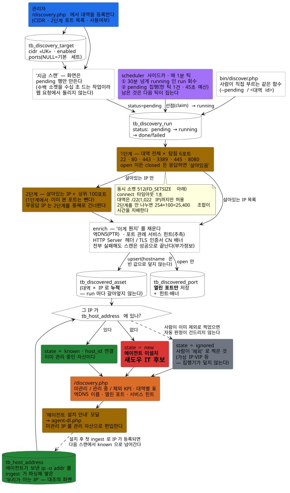
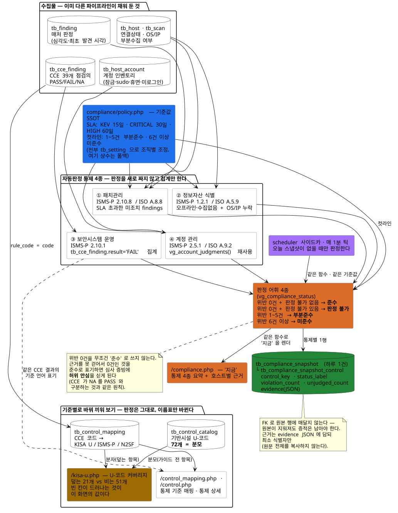
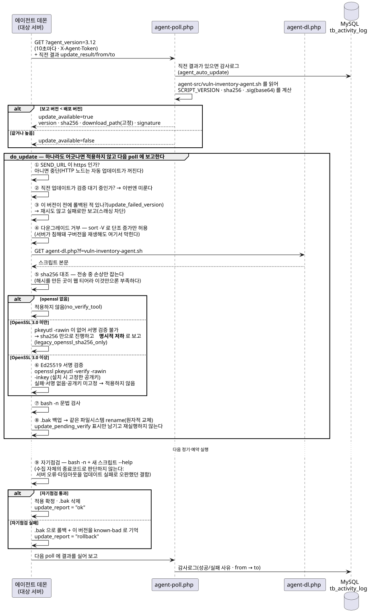

# 다이어그램

> 문서 기준: 2026-08-20. 구조 변경 시 `.puml`과 렌더된 `.svg`를 함께 갱신한다.

`docs/dev/architecture.md` 의 구조를 그림으로 옮긴 PlantUML 다이어그램 9종이다.
소스는 `.puml`, 같이 있는 `.svg` 는 그 렌더 결과다 — 아래 그림은 전부 그 `.svg` 이고, 클릭하면 원본이 열린다.
소스를 고쳤으면 [`render.sh`](render.sh) 로 다시 뽑는다(docker 로 폴더의 `*.puml` 을 한 번에, 몇 번 돌려도 결과는 같다).

**단 `erd.puml`·`erd.svg` 는 손으로 고치지 않는다** — 생성기가 소유하는 산출물이라 편집 경로가 다르다.
이유와 갱신 방법은 [ERD](#erd) 절 첫머리에 적었다. 나머지 8종은 손으로 쓰고 `render.sh` 로 뽑는 것이 맞다.

| 다이어그램 | 무슨 질문에 답하는가 | 소스 |
|---|---|---|
| [시스템 개요](#시스템-개요) | 에이전트가 보낸 JSON 이 어디를 거쳐 대시보드까지 가는가 | [`시스템개요.puml`](시스템개요.puml) |
| [매처 판정 로직](#매처-판정-로직) | 패키지에 걸린 CVE 를 CRITICAL~LOW 중 무엇으로 판정하고, 언제 억제하는가 | [`매처판정로직.puml`](매처판정로직.puml) |
| [피드 커넥터](#피드-커넥터) | CVE 정보를 어느 외부 소스에서, 누가 언제 긁어오는가 | [`피드커넥터.puml`](피드커넥터.puml) |
| [배포 구성](#배포-구성) | dev·prod 가 어떤 compose 파일·시크릿으로 어떤 컨테이너를 띄우는가 | [`배포구성.puml`](배포구성.puml) |
| [ERD](#erd) | 어떤 테이블이 있고 무엇으로 엮이는가 | [`erd.puml`](erd.puml) |
| [사이트맵](#사이트맵) | 웹에 어떤 화면이 있고 무슨 권한·인증으로 갈리는가 | [`사이트맵.puml`](사이트맵.puml) |
| [자산 탐색](#자산-탐색) | 에이전트가 안 깔린 자산(섀도우 IT)을 중앙이 어떻게 찾아내는가 | [`자산탐색.puml`](자산탐색.puml) |
| [컴플라이언스 판정](#컴플라이언스-판정) | 수집물이 어떻게 '준수/미준수' 가 되고 증적은 어디 남는가 | [`컴플라이언스판정.puml`](컴플라이언스판정.puml) |
| [에이전트 자동 업데이트](#에이전트-자동-업데이트) | 에이전트가 새 버전을 무인으로 받아 적용하기까지 무엇을 검증하는가 | [`에이전트자동업데이트.puml`](에이전트자동업데이트.puml) |

## 시스템 개요

에이전트가 POST 한 JSON 이 Caddy·`ingest.php`·MySQL·매처를 거쳐 대시보드에 뜨기까지의 흐름과, CVE
미러가 매처로 들어가 findings 를 만드는 갈래다. **자산을 아는 길이 둘**이라는 것이 요점이다 —
에이전트가 밀어 넣는 갈래 말고 중앙이 등록 대역을 훑는 갈래(`bin/discover.php`)가 따로 있다.
상세: [`architecture.md` §1](../../dev/architecture.md#1-시스템-개요-데이터-흐름).

## 매처 판정 로직

패키지에 걸린 CVE 하나가 CRITICAL~LOW 중 무엇이 되는지, 아니면 억제되는지를 결정하는 분기다.
억제 근거(changelog·errata·debsecan)와 억제 취소, 런타임 상태 7종, 그 위에 상태와 무관하게 한 단계를
더하는 KEV 가산(상한 CRITICAL)까지 담았다. 판정 규칙의 정본은
[`architecture.md` §2](../../dev/architecture.md#2-매처-판정-로직--실제로-위험한가) 와 `server/src/matcher/` 다.

## 피드 커넥터

scheduler 사이드카가 매 1분 due 커넥터를 조회해 외부 소스를 긁고 `tb_cve` 계열에 upsert 한 뒤 매처를
재계산시키는 경로다. `connectors.php` 의 설정·지금 실행·미리보기가 어디로 붙는지도 같이 있다.
소스별 역할은 [`피드소스-역할.md`](../../dev/피드소스-역할.md), 수집 구조는
[`architecture.md` §3](../../dev/architecture.md#3-cve-피드-커넥터-외부-소스-수집).

## 배포 구성

dev(메인 트리 / 워크트리)·prod 가 각각 어떤 compose 레이어를 겹쳐 쓰는지, Docker Secrets 가 어느
컨테이너로 들어가는지, prod 의 caddy·web·scheduler·db 가 어떤 포트·내부망으로 붙는지다. caddy 의 보안
응답 헤더와 에이전트 배포 경로(읽기전용 마운트 두 개 → `agent-dl.php`·`agent-poll.php`)도 그 노드에
적어 두었다. 상세: [`architecture.md` §4](../../dev/architecture.md#4-배포-구성-dev--prod).

## ERD

> **이 그림은 손으로 고치지 않는다.** `erd.puml` 과 `erd.svg` 는
> [`docs/dev/데이터베이스.md`](../../dev/데이터베이스.md)·[`docs/specs/테이블명세서.xlsx`](../테이블명세서.xlsx) 와 함께
> [`docs/specs/gen_table_spec.py`](../gen_table_spec.py) 가 **한 묶음으로 관리하는 생성물**이다.
> `erd.puml:2` 의 `' schema-docs: sha256:… tables=N` 마커도 생성기가 찍는다 — 본문만 PlantUML 로 고치면
> 마커가 옛 값으로 남아 파일 하나가 스스로와 어긋난다.
>
> - **갱신**: `SCHEMA_DOCS_UPDATE=1 tests/schema_docs_test.sh`
>   — disposable MySQL 에 초기 DDL 과 전체 마이그레이션을 적용하고, 그 information_schema 를 정본으로
>   `데이터베이스.md`·`erd.puml`·`테이블명세서.xlsx` 를 다시 쓴다. `erd.svg` 는 그 다음 `render.sh` 로 뽑는다.
> - **검사**: `python docs/specs/gen_table_spec.py --source repository --check`
>   — docker 없이 도는 오프라인 fallback 이다. 생성기 docstring 이 밝히듯 아래 게이트를 대신하지는 못한다.
>
> 넷이 어긋난 채로 두면 `deploy/gates.tsv` 의 **`schema-docs`**(required)가 drift 로 잡는다. 그런데 이 게이트는
> **`central` 프로파일 전용**이라 **개인 워크트리 pre-push 에는 없다** — 로컬은 전부 통과한 것처럼 보이다가
> 중앙에서 처음 터진다. 실제로 이 함정을 밟아 본 뒤에 남기는 경고다.
>
> `render.sh` 는 폴더의 `*.puml` 을 전부 훑으므로 `erd.svg` 도 같이 다시 뽑힌다. `erd.puml` 을 생성기로
> 갱신하지 않은 채 `render.sh` 만 돌렸다면 나온 `erd.svg` 는 되돌린다.

`tb_host`→`tb_scan` 을 축으로 패키지·노출·프로세스·계정·의존성 그래프와 판정 결과, CVE 미러 쪽 테이블이
어떻게 엮이는지다. 그림에 번호로만 적힌 것은 관계선이 한자리에 겹쳐 라벨을 뺀 자리다 — 억제 근거
② `tb_pkg_changelog_cve`(changelog 의 CVE 수정 기록) · ③ `tb_applied_errata`(벤더 권고) ·
④ `tb_debsecan`(데비안 트래커, 역방향), 억제 취소 ⑤ `tb_stale_lib`(패치됐지만 옛 `.so` 가 물려 있는 건).
테이블별 전체 컬럼은 [`데이터베이스.md`](../../dev/데이터베이스.md), 묶음별 설명은
[`architecture.md` §5](../../dev/architecture.md#5-데이터-모델-erd) 가 갖는다.

## 사이트맵

로그인부터 대시보드·호스트 상세·취약점·자산·피드·관리 화면까지의 구성이다. **화면마다 필요한 메뉴
권한을 `«assets»` 처럼 경로 옆에 적었고**(정본은 `server/src/view/nav.php` 의 `perm` 과 각 화면의
`vg_require_menu()`), 에이전트 키 인증 API·세션 인증 내보내기·화면이 뒤에서 부르는 엔드포인트·무인증
설치파일 배포도 별도 묶음으로 두었다. 사이드바 한 항목이 여는 서브탭 이동선도 같이 그렸다.
권한·인증 규칙은 [`architecture.md` §6](../../dev/architecture.md#6-웹-화면-구성-사이트맵--인증).

## 자산 탐색

관리 대역을 등록해 두면 중앙이 직접 훑어 **에이전트가 없는 자산**을 찾는 파이프라인이다 — 대역
등록(`tb_discovery_target`) → 스케줄러 틱 → 2단계 TCP connect 스윕 → 역DNS·서비스 힌트·배너 →
`tb_host_address` 대조 → 안 맞으면 섀도우 IT 후보. 취약점 스캔과는 별개 파이프라인이고 접점은 IP
대조 한 곳뿐이다. 상세: [`architecture.md` §1.2](../../dev/architecture.md#12-자산-탐색-섀도우-it).

## 컴플라이언스 판정

이미 쌓여 있는 수집물이 통제 4종(패치관리 / 정보자산 식별 / 보안시스템 운영 / 계정 관리)으로 집계되고,
판정 어휘 4종(준수 / 판정 불가 / 부분준수 / 미준수)을 거쳐 하루 1건 `tb_compliance_snapshot` 에 증적으로
남기까지다. 화면(`/compliance.php`)과 스케줄러가 같은 함수·같은 기준값(`tb_setting`)을 쓴다는 것도 이
그림의 요점이다. 판정 규칙은 [`architecture.md` §2.11](../../dev/architecture.md#211-컴플라이언스-판정-kisa-isms-p--iso-27001).

## 에이전트 자동 업데이트

에이전트가 10초마다 부르는 poll 에 자기 버전을 실어 보내는 데서 시작해, 노드가 무엇을 어떤 순서로
검증하고(HTTPS 전용 → 다운그레이드 거부 → sha256 → Ed25519 서명 → `bash -n` → 백업 후 원자적 교체)
교체 뒤 다음 실행의 자기점검으로 적용을 확정하거나 롤백하는지까지의 시퀀스다. 검증 겹과 예외
노드(OpenSSL 3.0 미만 등)의 정본은 [`agent/README.md`](../../../agent/README.md) 와
[`architecture.md` §4.1](../../dev/architecture.md#41-에이전트).

